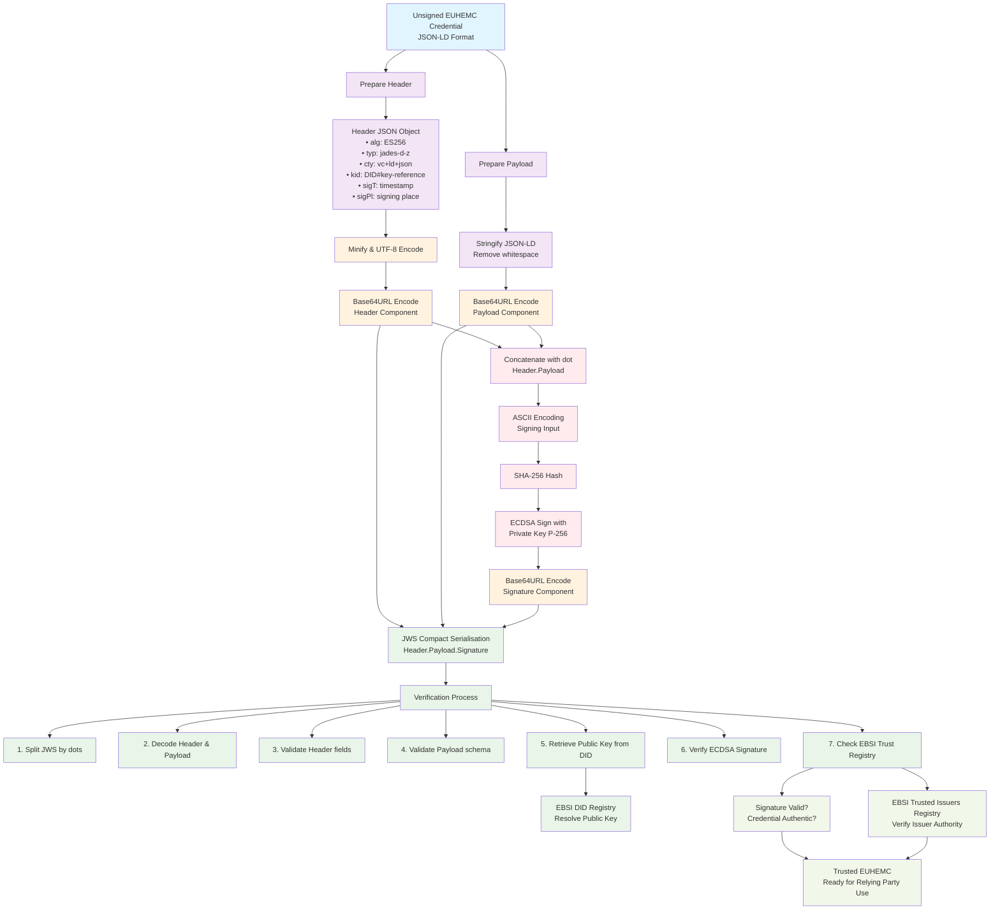

# Explanation of how the signature is applied to the European Higher Education Microcredential (EUHEMC) using the JAdES D-Zero signature profile, as specified in the European Blockchain Services Infrastructure (EBSI) framework

This explanation is designed to be clear and comprehensive, enabling a verifier to understand the process, confirm its correctness, and ensure it aligns with the provided EUHEMC schema and credential examples:

- `HigherEducationEuropeanMicroCredential_unsigned.md`
- `HigherEducationEuropeanMicroCredential_signed.md`

The explanation covers the technical steps, cryptographic details, and verification process, ensuring accessibility for both technical and non-technical stakeholders.

The EUHEMC signature is applied using the JAdES signature, a profile of JSON Web Signature (JWS), signing with ECDSA (ES256) using the issuer's private key. The process ensures authenticity, integrity, and compliance with EBSI, W3C, ETSI, and the Council Recommendation. Verifiers can decode the JWS, validate the schema, verify the signature, and check trust using standard cryptographic tools and EBSI registries. The explanation is designed to be clear for both technical and non-technical audiences, with sufficient detail for a verifier to confirm correctness.

## Detailed explanation of the EUHEMC signature application process

The EUHEMC is issued as a W3C Verifiable Credential, signed using the JAdES D-Zero profile, which is a JSON Advanced Electronic Signature (JAdES) profile defined by EBSI. The signature ensures the credential's authenticity, integrity, and non-repudiation, allowing verifiers (e.g., employers, institutions) to confirm that the credential was issued by a trusted higher education institution (e.g., Rovira i Virgili University) and has not been tampered with.

Below we outline the process step-by-step, followed by verification details and alignment with standards.

### 1. Overview of the Signature Process

The signature process transforms an unsigned EUHEMC credential (e.g., as shown in `HigherEducationEuropeanMicroCredential_unsigned.md`) into a signed credential (e.g., `HigherEducationEuropeanMicroCredential_signed-2.md`). The key steps are:

- **Prepare the Header**: Create a JSON object with metadata about the signature algorithm, type, and issuer details, then encode it as Base64URL.
- **Prepare the Payload**: Stringify and Base64URL encode the unsigned credential payload, ensuring all mandatory elements (per Annex I of the Council Recommendation) are included.
- **Sign**: Compute an ECDSA signature over the concatenated header and payload using the issuer's private key.
- **Combine**: Form the JWS Compact Serialisation by joining the Base64URL-encoded header, payload, and signature with dots (`<header>.<payload>.<signature>`).

The resulting JWS is a compact, verifiable representation of the signed EUHEMC, which can be stored in digital wallets (e.g., EUDIW wallet) and verified by third parties.

### 2. Detailed Steps for Applying the Signature

#### Step 1: Prepare the Protected Header

The header is a JSON object containing metadata about the signature. For the EUHEMC, it follows the JAdES D-Zero profile, which extends the JWS standard with specific fields for EBSI. The header from `HigherEducationEuropeanMicroCredential_signed.md` is:

```json
{
  "alg": "ES256",
  "typ": "jades-d-z",
  "cty": "vc+ld+json",
  "kid": "did:ebsi:ziuFQNRWr6vNeEpTgimmCpw#keys-1",
  "crit": ["sigT", "sigPl"],
  "sigT": "2025-05-04T10:00:00Z",
  "sigPl": {
    "addressCountry": "ES",
    "addressLocality": "Tarragona",
    "postalCode": "43007",
    "streetAddress": "Carrer de l'Escorxador, s/n"
  }
}
```

**Fields Explained:**

- `"alg": "ES256"`: Specifies the Elliptic Curve Digital Signature Algorithm (ECDSA) with SHA-256, using the P-256 curve. This is the cryptographic algorithm for signing.
- `"typ": "jades-d-z"`: Indicates the JAdES D-Zero profile, a detached JSON signature format used by EBSI.
- `"cty": "vc+ld+json"`: Content type, identifying the payload as W3C Verifiable Credential.
- `"kid"`: Key Identifier, referencing the issuer's public key in their Decentralised Identifier (DID) document (e.g., `did:ebsi:ziuFQNRWr6vNeEpTgimmCpw#keys-1` for Rovira i Virgili University).
- `"crit": ["sigT", "sigPl"]`: Critical extensions, indicating that the `sigT` and `sigPl` fields must be understood by verifiers.
- `"sigT"`: Signature creation time and date, ensuring temporal context.
- `"sigPl"`: Signing place, providing the issuer's physical address (e.g., Tarragona, Spain), enhancing legal and contextual trust.

**Encoding:**
- The header is converted to a UTF-8 string, minified (removing whitespace), and encoded as Base64URL (safe for URL transmission, replacing `+` with `-`, `/` with `_`, and removing `=` padding).
- Resulting Base64URL (from the signed example):
  ```
  eyJhbGciOiJFUzI1NiIsInR5cCI6ImphZGVzLWQteiIsImN0eSI6InZjK2xkK2pzb24iLCJraWQiOiJkaWQ6ZWJ
  zaTp6aXVGUU5SV3I2dk5lRXBUZ2ltbUNwdyNrZXlzLTEiLCJjcml0IjpbInNpZ1QiLCJzaWdQbCJdLCJzaWd
  UIjoiMjAyNS0wNS0wNFQxMDowMDowMFoiLCJzaWdQbCI6eyJhZGRyZXNzQ291bnRyeSI6IkVTIiwiYWR
  kcmVzc0xvY2FsaXR5IjoiVGFycmFnb25hIiwicG9zdGFsQ29kZSI6IjQzMDA3Iiwic3RyZWV0QWRkcmVzcy
  I6IkNhcnJlciBkZSBsJ0VzY29yeGFkb3IsIHMvbiJ9fQ
  ```

#### Step 2: Prepare the Payload

The payload is the unsigned EUHEMC credential, as shown in `HigherEducationEuropeanMicroCredential_unsigned.md`. It is minified to remove unnecessary whitespace and encoded as Base64URL.

**Payload Content:**
- The payload is a JSON-LD Verifiable Credential containing all mandatory Annex I elements (e.g., learner identification, issuer country, learning outcomes, 5 ECTS credits, ESG quality assurance).
- Example (minified from the unsigned credential):

```json
{"@context":["https://www.w3.org/2018/credentials/v1","https://w3id.org/edc/v1"],"id":"urn:uuid:4f8d7c9e-9a1b-4b1e-8f2a-5c3e6d7b9c0d","type":["VerifiableCredential","EuropeanDigitalCredential","EuropeanHigherEducationMicroCredentials"],"issuer":{"id":"did:ebsi:ziuFQNRWr6vNeEpTgimmCpw"},"issuerCountry":{"id":"urn:concept:es","type":"Concept","prefLabel":{"en":"Spain"}},"issuanceDate":"2025-05-04T10:00:00Z","issued":"2025-05-04T10:00:00Z","validFrom":"2025-05-04T10:00:00Z","qualityAssurance":{"id":"urn:concept:esg","type":"Concept","prefLabel":{"en":"ESG-compliant"}},"credentialSubject":{"id":"did:ebsi:example:student123","type":"Person","fullName":{"en":"Juan Pérez García"},"givenName":{"en":"Juan"},"familyName":{"en":"Pérez"},"nationalID":{"id":"urn:legal:es:DNI:12345678Z","type":"LegalIdentifier","notation":"12345678Z","spatial":{"id":"urn:concept:es","type":"Concept","prefLabel":{"en":"Spain"}}},"hasClaim":[{"id":"urn:uuid:1a2b3c4d-5e6f-7g8h-9i0j-1k2l3m4n5o6p","type":"LearningAchievement","title":{"en":"Advanced Data Analysis"},"creditReceived":[{"id":"urn:uuid:2b3c4d5e-6f7g-8h9i-0j1k-2l3m4n5o6p7q","type":"CreditPoint","framework":{"id":"urn:concept:ECTS","type":"Concept","prefLabel":{"en":"ECTS"}},"point":"5"}],"level":{"id":"urn:concept:eqf6","type":"Concept","prefLabel":{"en":"EQF Level 6"}},"participationForm":{"id":"urn:concept:online","type":"Concept","prefLabel":{"en":"Online"}},"stackability":{"id":"urn:concept:stackable","type":"Concept","prefLabel":{"en":"Stackable towards degree"}},"learningOutcome":[{"id":"urn:uuid:3c4d5e6f-7g8h-9i0j-1k2l-3m4n5o6p7q8r","type":"LearningOutcome","title":{"en":"Ability to analyze large datasets"},"relatedCompetence":[{"id":"urn:concept:dataanalysis","type":"Concept","prefLabel":{"en":"Data Analysis"}}],"relatedESCOSkill":[{"id":"http://data.europa.eu/esco/skill/12345","type":"Concept","prefLabel":{"en":"Statistical Data Analysis"}}]}],"awardedBy":{"id":"urn:uuid:award1","type":"AwardingProcess","awardingBody":{"id":"did:ebsi:ziuFQNRWr6vNeEpTgimmCpw","type":"Organisation","legalName":{"en":"Rovira i Virgili University"}}}},{"id":"urn:uuid:4d5e6f7g-8h9i-0j1k-2l3m-4n5o6p7q8r9s","type":"LearningAssessment","title":{"en":"Data Analysis Exam"},"assessmentType":{"id":"urn:concept:exam","type":"Concept","prefLabel":{"en":"Written Exam"}},"grade":{"id":"urn:uuid:5e6f7g8h-9i0j-1k2l-3m4n-5o6p7q8r9s0t","type":"Note","noteLiteral":{"en":"85/100"}},"awardedBy":{"id":"urn:uuid:award2","type":"AwardingProcess","awardingBody":{"id":"did:ebsi:ziuFQNRWr6vNeEpTgimmCpw","type":"Organisation","legalName":{"en":"Rovira i Virgili University"}}}}]},"credentialSchema":{"id":"https://trusted-registries.ebsi.eu/schemas/euhemc/1.0","type":"JsonSchema"},"displayParameter":{"id":"urn:uuid:6f7g8h9i-0j1k-2l3m-4n5o-6p7q8r9s0t1u","type":"DisplayParameter","title":{"en":"EUHEMC Display"},"language":[{"id":"urn:concept:en","type":"Concept","prefLabel":{"en":"English"}}],"primaryLanguage":{"id":"urn:concept:en","type":"Concept","prefLabel":{"en":"English"}},"individualDisplay":[{"id":"urn:uuid:7g8h9i0j-1k2l-3m4n-5o6p-7q8r9s0t1u2v","type":"IndividualDisplay","fieldPath":"credentialSubject.fullName","label":{"en":"Full Name"},"order":1},{"id":"urn:uuid:8h9i0j1k-2l3m-4n5o-6p7q-8r9s0t1u2v3w","type":"IndividualDisplay","fieldPath":"credentialSubject.hasClaim[0].title","label":{"en":"Achievement Title"},"order":2}]}}
```

**Encoding:**
- The payload is encoded as Base64URL, resulting in a string (as shown in the signed example):
  ```
  eyJAY29udGV4dCI6WyJodHRwczovL3d3dy53My5vcmcvMjAxOC9jcmVkZW50aWFscy92MSIsImh0dH
  BzOi8vdzNpZC5vcmcvZWRjL3YxIl0sImlkIjoidXJuOnV1aWQ6NGY4ZDdjOWUtOWExYi00YjFlLThmMm
  EtNWMzZTZkN2I5YzBkIiwidHlwZSI6WyJWZXJpZmlhYmxlQ3JlZGVudGlhbCIsIkV1cm9wZWFuRGlnaXR
  hbENyZWRlbnRpYWwiLCJFdXJvcGVhbkhpZ2hlckVkdWNhdGlvbk1pY3JvQ3JlZGVudGlhbHMiXSwiaXN
  zdWVyIjp7ImlkIjoiZGlkOmVic2k6eml1RlFOUldyNnZOZUVwVGdpbW1DcHcifSwiaXNzdWVyQ291bnR
  yeSI6eyJpZCI6InVybjpjb25jZXB0OmVzIiwidHlwZSI6IkNvbmNlcnQiLCJwcmVmTGFiZWwiOnsiZW4iOiJ
  TcGFpbiJ9fSwiaXNzdWFuY2VEYXRlIjoiMjAyNS0wNS0wNFQxMDowMDowMFoiLCJpc3N1ZWQiOiIyM
  DI1LTA1LTA0VDEwOjAwOjAwWiIsInZhbGlkRnJvbSI6IjIwMjUtMDUtMDRUMTA6MDA6MDBaIiwicXVhb
  Gl0eUFzc3VyYW5jZSI6eyJpZCI6InVybjpjb25jZXB0OmVzZyIsInR5cGUiOiJDb25jZXB0IiwicHJlZkxhYmVs
  Ijp7ImVuIjoiRVNHLWNvbXBsaWFudCJ9fSwiY3JlZGVudGlhbFN1YmplY3QiOnsiaWQiOiJkaWQ6ZWJza
  TpleGFtcGxlOnN0dWRlbnQxMjMiLCJ0eXBlIjoiUGVyc29uIiwiZnVsbE5hbWUiOnsiZW4iOiJKdWFuIFDD
  qXJleiBHYXJj7WEifSwiZ2l2ZW5OYW1lIjp7ImVuIjoiSnVhbiJ9LCJmYW1pbHlOYW1lIjp7ImVuIjoiUMOpc
  mV6In0sIm5hdGlvbmFsSUQiOnsiaWQiOiJ1cm46bGVnYWw6ZXM6RE5JOjEyMzQ1Njc4WiIsInR5cGUi
  OiJMZWdhbElkZW50aWZpZXIiLCJub3RhdGlvbiI6IjEyMzQ1Njc4WiIsInNwYXRpYWwiOnsiaWQiOiJ1cm
  46Y29uY2VwdDplcyIsInR5cGUiOiJDb25jZXB0IiwicHJlZkxhYmVsIjp7ImVuIjoiU3BhaW4ifX19LCJoYXND
  bGFpbSI6W3siaWQiOiJ1cm46dXVpZDoxYTJiM2M0ZC01ZTZmLTdnOGgtOWkwai0xazJsM200bjVvNnAi
  LCJ0eXBlIjoiTGVhcm5pbmdBY2hpZXZlbWVudCIsInRpdGxlIjp7ImVuIjoiQWR2YW5jZWQgRGF0YSBBb
  mFseXNpcyJ9LCJjcmVkaXRSZWNlaXZlZCI6W3siaWQiOiJ1cm46dXVpZDoyYjNjNGQ1ZS02ZjdnLThoO
  WktMGoxay0ybDNtNG41bzZwN3EiLCJ0eXBlIjoiQ3JlZGl0UG9pbnQiLCJmcmFtZXdvcmsiOnsiaWQiOiJ
  1cm46Y29uY2VwdDpFQ1RTIiwidHlwZSI6IkNvbmNlcnQiLCJwcmVmTGFiZWwiOnsiZW4iOiJFQ1RTIn1
  9LCJwb2ludCI6IjUifV0sImxldmVsIjp7ImlkIjoidXJuOmNvbmNlcnQ6ZXFmNiIsInR5cGUiOiJDb25jZXB0Ii
  wicHJlZkxhYmVsIjp7ImVuIjoiRVFGIExldmVsIDYifX0sInBhcnRpY2lwYXRpb25Gb3JtIjp7ImlkIjoidXJuOm
  NvbmNlcnQ6b25saW5lIiwidHlwZSI6IkNvbmNlcnQiLCJwcmVmTGFiZWwiOnsiZW4iOiJPbmxpbmUifX
  0sInN0YWNrYWJpbGl0eSI6eyJpZCI6InVybjpjb25jZXB0OnN0YWNrYWJsZSIsInR5cGUiOiJDb25jZXB0Ii
  wicHJlZkxhYmVsIjp7ImVuIjoiU3RhY2thYmxlIHRvd2FyZHMgZGVncmVlIn19LCJsZWFybmluZ091dGNv
  bWUiOlt7ImlkIjoidXJuOnV1aWQ6M2M0ZDVlNmYtN2c4aC05aTBqLTFrMmwtM200bjVvNnA3cThyIiwid
  HlwZSI6IkxlYXJuaW5nT3V0Y29tZSIsInRpdGxlIjp7ImVuIjoiQWJpbGl0eSB0byBhbmFseXplIGxhcmdlIG
  RhdGFzZXRzIn0sInJlbGF0ZWRDb21wZXRlbmNlIjpbeyJpZCI6InVybjpjb25jZXB0OmRhdGEtYW5hbHlza
  XMiLCJ0eXBlIjoiQ29uY2VwdCIsInByZWZMYWJlbCI6eyJlbiI6IkRhdGEgQW5hbHlzaXMifX1dLCJyZWxhd
  GVkRVNDT1NraWxsIjpbeyJpZCI6Imh0dHA6Ly9kYXRhLmV1cm9wYS5ldS9lc2NvL3NraWxsLzEyMzQ1I
  iwidHlwZSI6IkNvbmNlcnQiLCJwcmVmTGFiZWwiOnsiZW4iOiJTdGF0aXN0aWNhbCBEYXRhIEFuYWx5
  c2lzIn19XX1dLCJhd2FyZGVkQnkiOnsiaWQiOiJ1cm46dXVpZDphd2FyZC0xIiwidHlwZSI6IkF3YXJkaW5
  nUHJvY2VzcyIsImF3YXJkaW5nQm9keSI6eyJpZCI6ImRpZDplYnNpOnppdUZRTlJXcjZ2TmVFcFRnaW1t
  Q3B3IiwidHlwZSI6Ik9yZ2FuaXNhdGlvbiIsImxlZ2FsTmFtZSI6eyJlbiI6IlJvdmlyYSBpIFZpcmdpbGkgVW5
  pdmVyc2l0eSJ9fX19LHsiaWQiOiJ1cm46dXVpZDo0ZDVlNmY3Zy04aDlpLTBqMWstMmwzbS00bjVvNn
  A3cThyOXMiLCJ0eXBlIjoiTGVhcm5pbmdBc3Nlc3NtZW50IiwidGl0bGUiOnsiZW4iOiJEYXRhIEFuYWx5
  c2lzIEV4YW0ifSwiYXNzZXNzbWVudFR5cGUiOnsiaWQiOiJ1cm46Y29uY2VwdDpleGFtIiwidHlwZSI6Ik
  NvbmNlcnQiLCJwcmVmTGFiZWwiOnsiZW4iOiJXcml0dGVuIEV4YW0ifX0sImdyYWRlIjp7ImlkIjoidXJuO
  nV1aWQ6NWU2ZjdnOGgtOWkwai0xazJsLTMtNG4tNW82cDdxOHI5czB0IiwidHlwZSI6Ik5vdGUiLCJub
  3RlTGl0ZXJhbCI6eyJlbiI6Ijg1LzEwMCJ9fSwiYXdhcmRGVkQnkiOnsiaWQiOiJ1cm46dXVpZDphd2FyZC0
  yIiwidHlwZSI6IkF3YXJkaW5nUHJvY2VzcyIsImF3YXJkaW5nQm9keSI6eyJpZCI6ImRpZDplYnNpOnppdU
  ZRTlJXcjZ2TmVFcFRnaW1tQ3B3IiwidHlwZSI6Ik9yZ2FuaXNhdGlvbiIsImxlZ2FsTmFtZSI6eyJlbiI6IlJvdml
  yYSBpIFZpcmdpbGkgVW5pdmVyc2l0eSJ9fX19XX0sImNyZWRlbnRpYWxTY2hlbWEiOnsiaWQiOiJodH
  RwczovL3RydXN0ZWQtcmVnaXN0cmllcy5lYnNpLmV1L3NjaGVtYXMvZXVoZW1jLzEuMCIsInR5cGUi
  OiJKc29uU2NoZW1hIn0sImRpc3BsYXlQYXJhbWV0ZXIiOnsiaWQiOiJ1cm46dXVpZDo2ZjdnOGg5aS0waj
  FrLTJsM20tNG41by02cDdxOHI5czB0MXUiLCJ0eXBlIjoiRGlzcGxheVBhcmFtZXRlciIsInRpdGxlIjp7ImVu
  IjoiRVUIRU1DIERpc3BsYXkifSwibGFuZ3VhZ2UiOlt7ImlkIjoidXJuOmNvbmNlcnQ6ZW4iLCJ0eXBlI
  joiQ29uY2VwdCIsInByZWZMYWJlbCI6eyJlbiI6IkVuZ2xpc2gifX1dLCJwcmltYXJ5TGFuZ3VhZ2Ui
  OnsiaWQiOiJ1cm46Y29uY2VwdDplbiIsInR5cGUiOiJDb25jZXB0IiwicHJlZkxhYmVsIjp7ImVuIjoiRW5
  nbGlzaCJ9fSwiaW5kaXZpZHVhbERpc3BsYXkiOlt7ImlkIjoidXJuOnV1aWQ6N2c4aDlpMGotMWsybC0zb
  TRuLTVvNnAtN3E4cjlzMHQxdTJ2IiwidHlwZSI6IkluZGl2aWR1YWxEaXNwbGF5IiwiZmllbGRQYXRoI
  joiY3JlZGVudGlhbFN1YmplY3QuZnVsbE5hbWUiLCJsYWJlbCI6eyJlbiI6IkZ1bGwgTmFtZSJ9LCJvc
  mRlciI6MX0seyJpZCI6InVybjp1dWlkOjhoOWkwajFrLTJsM20tNG41by02cDdxLThyOXMwdDF1MnYzd3
  ciLCJ0eXBlIjoiSW5kaXZpZHVhbERpc3BsYXkiLCJmaWVsZFBhdGgiOiJjcmVkZW50aWFsU3ViamVjdC
  5oYXNDbGFpbVswXS50aXRsZSIsImxhYmVsIjp7ImVuIjoiQWNoaWV2ZW1lbnQgVGl0bGUifSwib3JkZXIi
  OjJ9XX19
  ```

#### Step 3: Compute the Signature

The signature is generated using the issuer's private key, which corresponds to the public key referenced in the `kid` (e.g., `did:ebsi:ziuFQNRWr6vNeEpTgimmCpw#keys-1`). The example provides a placeholder key:

```json
{
  "kty": "EC",
  "x": "9f00-IlhEFVmlpCU8u51i4ZqCAY1bMHUu5OEbXOrOz8",
  "y": "84Mp_hrdzqRDD3a8DNYPONWJYPND1H6WkN-NmnrRbD8",
  "crv": "P-256",
  "d": "Cb-7omOc3t9dSK6qx6ss6QenLS2EIB-wG7tfZJW_Tbw"
}
```

**Process:**

- **Input**: Concatenate the Base64URL-encoded header and payload with a dot separator:
  ```
  ASCII(BASE64URL(UTF8(Header)) || '.' || BASE64URL(Payload))
  ```
  This forms the signing input, a string like:
  ```
  eyJhbGciOiJFUzI1NiIsInR5cCI6ImphZGVzLWQteiIsImN0eSI6InZjK2xkK2pzb24iLCJraWQiOiJkaWQ6ZWJ
  zaTp6aXVGUU5SV3I2dk5lRXBUZ2ltbUNwdyNrZXlzLTEiLCJjcml0IjpbInNpZ1QiLCJzaWdQbCJdLCJzaWd
  UIjoiMjAyNS0wNS0wNFQxMDowMDowMFoiLCJzaWdQbCI6eyJhZGRyZXNzQ291bnRyeSI6IkVTIiwiYWR
  kcmVzc0xvY2FsaXR5IjoiVGFycmFnb25hIiwicG9zdGFsQ29kZSI6IjQzMDA3Iiwic3RyZWV0QWRkcmVzcy
  I6IkNhcnJlciBkZSBsJ0VzY29yeGFkb3IsIHMvbiJ9fQ.<Base64URL Payload>
  ```

- **Hashing**: Compute a SHA-256 hash of the signing input to create a fixed-length digest.
- **Signing**: Use the issuer's private key (`d` in the EC key) to sign the digest with ECDSA over the P-256 curve, producing a signature (a pair of integers, `r` and `s`).
- **Encoding**: The signature is encoded as Base64URL. In the example, a placeholder (`[signature-placeholder]`) is used, as the actual signature requires the private key, which is not computed here.

**Key Details:**
- The private key is securely stored by the issuer (e.g., in a hardware security module or EBSI wallet).
- The public key is published in the issuer's DID document, accessible via EBSI's trusted registries, allowing verifiers to retrieve it for validation.

#### Step 4: Combine into JWS Compact Serialisation

The final JWS is formed by concatenating the three Base64URL-encoded components with dots as defined in RFC 7515:

```
<header>.<payload>.<signature>
```

Example (from `HigherEducationEuropeanMicroCredential_signed.md`, with placeholder):

```
eyJhbGciOiJFUzI1NiIsInR5cCI6ImphZGVzLWQteiIsImN0eSI6InZjK2xkK2pzb24iLCJraWQiOiJkaWQ
6ZWJzaTp6aXVGUU5SV3I2dk5lRXBUZ2ltbUNwdyNrZXlzLTEiLCJjcml0IjpbInNpZ1QiLCJzaWdQbCJ
dLCJzaWdUIjoiMjAyNS0wNS0wNFQxMDowMDowMFoiLCJzaWdQbCI6eyJhZGRyZXNzQ291bnRye
SI6IkVTIiwiYWRkcmVzc0xvY2FsaXR5IjoiVGFycmFnb25hIiwicG9zdGFsQ29kZSI6IjQzMDA3Iiwic3R
yZWV0QWRkcmVzcyI6IkNhcnJlciBkZSBsJ0VzY29yeGFkb3IsIHMvbiJ9fQ.eyJAY29udGV4dCI6WyJo
dHRwczovL3d3dy53My5vcmcvMjAxOC9jcmVkZW50aWFscy92MSIsImh0dHBzOi8vdzNpZC5vcm
cvZWRjL3YxIl0sImlkIjoidXJuOnV1aWQ6NGY4ZDdjOWUtOWExYi00YjFlLThmMmEtNWMzZTZkN2I
5YzBkIiwidHlwZSI6WyJWZXJpZmlhYmxlQ3JlZGVudGlhbCIsIkV1cm9wZWFuRGlnaXRhbENyZWRlb
nRpYWwiLCJFdXJvcGVhbkhpZ2hlckVkdWNhdGlvbk1pY3JvQ3JlZGVudGlhbHMiXSwiaXNzdWVyIjp
7ImlkIjoiZGlkOmVic2k6eml1RlFOUldyNnZOZUVwVGdpbW1DcHcifSwiaXNzdWVyQ291bnRyeSI6
eyJpZCI6InVybjpjb25jZXB0OmVzIiwidHlwZSI6IkNvbmNlcnQiLCJwcmVmTGFiZWwiOnsiZW4iOiJTc
GFpbiJ9fSwiaXNzdWFuY2VEYXRlIjoiMjAyNS0wNS0wNFQxMDowMDowMFoiLCJpc3N1ZWQiOiIyM
DI1LTA1LTA0VDEwOjAwOjAwWiIsInZhbGlkRnJvbSI6IjIwMjUtMDUtMDRUMTA6MDA6MDBaIiwicX
VhbGl0eUFzc3VyYW5jZSI6eyJpZCI6InVybjpjb25jZXB0OmVzZyIsInR5cGUiOiJDb25jZXB0IiwicHJlZk
xhYmVsIjp7ImVuIjoiRVNHLWNvbXBsaWFudCJ9fSwiY3JlZGVudGlhbFN1YmplY3QiOnsiaWQiOiJka
WQ6ZWJzaTpleGFtcGxlOnN0dWRlbnQxMjMiLCJ0eXBlIjoiUGVyc29uIiwiZnVsbE5hbWUiOnsiZW4i
OiJKdWFuIFDDqXJleiBHYXJj7WEifSwiZ2l2ZW5OYW1lIjp7ImVuIjoiSnVhbiJ9LCJmYW1pbHlOYW1lIj
p7ImVuIjoiUMOpcmV6In0sIm5hdGlvbmFsSUQiOnsiaWQiOiJ1cm46bGVnYWw6ZXM6RE5JOjEyM
zQ1Njc4WiIsInR5cGUiOiJMZWdhbElkZW50aWZpZXIiLCJub3RhdGlvbiI6IjEyMzQ1Njc4WiIsInNwYX
RpYWwiOnsiaWQiOiJ1cm46Y29uY2VwdDplcyIsInR5cGUiOiJDb25jZXB0IiwicHJlZkxhYmVsIjp7ImV
uIjoiU3BhaW4ifX19LCJoYXNDbGFpbSI6W3siaWQiOiJ1cm46dXVpZDoxYTJiM2M0ZC01ZTZmLTdn
OGgtOWkwai0xazJsM200bjVvNnAiLCJ0eXBlIjoiTGVhcm5pbmdBY2hpZXZlbWVudCIsInRpdGxlIjp7
ImVuIjoiQWR2YW5jZWQgRGF0YSBBbmFseXNpcyJ9LCJjcmVkaXRSZWNlaXZlZCI6W3siaWQiOiJ1
cm46dXVpZDoyYjNjNGQ1ZS02ZjdnLThoOWktMGoxay0ybDNtNG41bzZwN3EiLCJ0eXBlIjoiQ3JlZG
l0UG9pbnQiLCJmcmFtZXdvcmsiOnsiaWQiOiJ1cm46Y29uY2VwdDpFQ1RTIiwidHlwZSI6IkNvbmN
lcnQiLCJwcmVmTGFiZWwiOnsiZW4iOiJFQ1RTIn19LCJwb2ludCI6IjUifV0sImxldmVsIjp7ImlkIjoidX
JuOmNvbmNlcnQ6ZXFmNiIsInR5cGUiOiJDb25jZXB0IiwicHJlZkxhYmVsIjp7ImVuIjoiRVFGIExldmV
sIDYifX0sInBhcnRpY2lwYXRpb25Gb3JtIjp7ImlkIjoidXJuOmNvbmNlcnQ6b25saW5lIiwidHlwZSI6Ik
NvbmNlcnQiLCJwcmVmTGFiZWwiOnsiZW4iOiJPbmxpbmUifX0sInN0YWNrYWJpbGl0eSI6eyJpZCI
6InVybjpjb25jZXB0OnN0YWNrYWJsZSIsInR5cGUiOiJDb25jZXB0IiwicHJlZkxhYmVsIjp7ImVuIjoiU3
RhY2thYmxlIHRvd2FyZHMgZGVncmVlIn19LCJsZWFybmluZ091dGNvbWUiOlt7ImlkIjoidXJuOnV1a
WQ6M2M0ZDVlNmYtN2c4aC05aTBqLTFrMmwtM200bjVvNnA3cThyIiwidHlwZSI6IkxlYXJuaW5nT3
V0Y29tZSIsInRpdGxlIjp7ImVuIjoiQWJpbGl0eSB0byBhbmFseXplIGxhcmdlIGRhdGFzZXRzIn0sInJlb
GF0ZWRDb21wZXRlbmNlIjpbeyJpZCI6InVybjpjb25jZXB0OmRhdGEtYW5hbHlzaXMiLCJ0eXBlIjoiQ
29uY2VwdCIsInByZWZMYWJlbCI6eyJlbiI6IkRhdGEgQW5hbHlzaXMifX1dLCJyZWxhdGVkRVNDT1N
raWxsIjpbeyJpZCI6Imh0dHA6Ly9kYXRhLmV1cm9wYS5ldS9lc2NvL3NraWxsLzEyMzQ1IiwidHlwZS
I6IkNvbmNlcnQiLCJwcmVmTGFiZWwiOnsiZW4iOiJTdGF0aXN0aWNhbCBEYXRhIEFuYWx5c2lzIn1
9XX1dLCJhd2FyZGVkQnkiOnsiaWQiOiJ1cm46dXVpZDphd2FyZC0xIiwidHlwZSI6IkF3YXJkaW5nUH
JvY2VzcyIsImF3YXJkaW5nQm9keSI6eyJpZCI6ImRpZDplYnNpOnppdUZRTlJXcjZ2TmVGcFRnaW1t
Q3B3IiwidHlwZSI6Ik9yZ2FuaXNhdGlvbiIsImxlZ2FsTmFtZSI6eyJlbiI6IlJvdmlyYSBpIFZpcmdpbGkgV
W5pdmVyc2l0eSJ9fX19LHsiaWQiOiJ1cm46dXVpZDo0ZDVlNmY3Zy04aDlpLTBqMWstMmwzbS00
bjVvNnA3cThyOXMiLCJ0eXBlIjoiTGVhcm5pbmdBc3Nlc3NtZW50IiwidGl0bGUiOnsiZW4iOiJEYXRh
IEFuYWx5c2lzIEV4YW0ifSwiYXNzZXNzbWVudFR5cGUiOnsiaWQiOiJ1cm46Y29uY2VwdDpleGFtIi
widHlwZSI6IkNvbmNlcnQiLCJwcmVmTGFiZWwiOnsiZW4iOiJXcml0dGVuIEV4YW0ifX0sImdyYWRl
Ijp7ImlkIjoidXJuOnV1aWQ6NWU2ZjdnOGgtOWkwai0xazJsLTMtNG4tNW82cDdxOHI5czB0IiwidHl
wZSI6Ik5vdGUiLCJub3RlTGl0ZXJhbCI6eyJlbiI6Ijg1LzEwMCJ9fSwiYXdhcmRGVkQnkiOnsiaWQiOiJ1
cm46dXVpZDphd2FyZC0yIiwidHlwZSI6IkF3YXJkaW5nUHJvY2VzcyIsImF3YXJkaW5nQm9keSI6eyJ
pZCI6ImRpZDplYnNpOnppdUZRTlJXcjZ2TmVGcFRnaW1tQ3B3IiwidHlwZSI6Ik9yZ2FuaXNhdGlvbiI
sImxlZ2FsTmFtZSI6eyJlbiI6IlJvdmlyYSBpIFZpcmdpbGkgVW5pdmVyc2l0eSJ9fX19XX0sImNyZWRlb
nRpYWxTY2hlbWEiOnsiaWQiOiJodHRwczovL3RydXN0ZWQtcmVnaXN0cmllcy5lYnNpLmV1L3Nja
GVtYXMvZXVoZW1qLzEuMCIsInR5cGUiOiJKc29uU2NoZW1hIn0sImRpc3BsYXlQYXJhbWV0ZXIiOn
siaWQiOiJ1cm46dXVpZDo2ZjdnOGg5aS0wajFrLTJsM20tNG41by02cDdxOHI5czB0MXUiLCJ0eXBlI
joiRGlzcGxheVBhcmFtZXRlciIsInRpdGxlIjp7ImVuIjoiRVUIRU1DIERpc3BsYXkifSwibGFuZ3VhZ2Ui
Olt7ImlkIjoidXJuOmNvbmNlcnQ6ZW4iLCJ0eXBlIjoiQ29uY2VwdCIsInByZWZMYWJlbCI6eyJlbiI6IkV
uZ2xpc2gifX1dLCJwcmltYXJ5TGFuZ3VhZ2UiOnsiaWQiOiJ1cm46Y29uY2VwdDplbiIsInR5cGUiOiJD
b25jZXB0IiwicHJlZkxhYmVsIjp7ImVuIjoiRW5nbGlzaCJ9fSwiaW5kaXZpZHVhbERpc3BsYXkiOlt7Iml
kIjoidXJuOnV1aWQ6N2c4aDlpMGotMWsybC0zbTRuLTVvNnAtN3E4cjlzMHQxdTJ2IiwidHlwZSI6Ikl
uZGl2aWR1YWxEaXNwbGF5IiwiZmllbGRQYXRoIjoiY3JlZGVudGlhbFN1YmplY3QuZnVsbE5hbWUi
LCJsYWJlbCI6eyJlbiI6IkZ1bGwgTmFtZSJ9LCJvcmRlciI6MX0seyJpZCI6InVybjp1dWlkOjhoOWkwajF
rLTJsM20tNG41by02cDdxLThyOXMwdDF1MnYzd3ciLCJ0eXBlIjoiSW5kaXZpZHVhbERpc3BsYXkiL
CJmaWVsZFBhdGgiOiJjcmVkZW50aWFsU3ViamVjdC5oYXNDbGFpbVswXS50aXRsZSIsImxhYmV
sIjp7ImVuIjoiQWNoaWV2ZW1lbnQgVGl0bGUifSwib3JkZXIiOjJ9XX19.[signature-placeholder]
```

**Note**: The actual signature is not computed in the example due to the private key's sensitivity, but the placeholder indicates where it would be placed.

### 3. Verification Process

A verifier (e.g., an employer or institution) checks the signed EUHEMC to ensure its authenticity, integrity, and issuer trustworthiness. The process, as outlined in `HigherEducationEuropeanMicroCredential_signed-2.md`, is:

1. **Decode the JWS:**
   - Split the JWS into three parts: `<header>.<payload>.<signature>` using the dot separator.
   - Decode the Base64URL-encoded header and payload to retrieve the JSON objects.

2. **Validate the Header:**
   - Check that `alg` is `ES256`, `typ` is `jades-d-z`, and `cty` is `vc+ld+json`.
   - Verify the `kid` references a valid DID (e.g., `did:ebsi:ziuFQNRWr6vNeEpTgimmCpw#keys-1`).
   - Ensure `sigT` (timestamp) is reasonable (e.g., not expired or in the future).
   - Confirm `sigPl` contains a valid issuer address (e.g., Tarragona, Spain).

3. **Validate the Payload:**
   - Parse the decoded payload as JSON-LD and validate against the EUHEMC schema (`euhemc-schema.json`).
   - Ensure all mandatory Annex I elements are present (e.g., learner `fullName`, `issuerCountry`, `creditReceived`, `qualityAssurance`).
   - Verify the `credentialSchema.id` (e.g., `https://trusted-registries.ebsi.eu/schemas/euhemc/1.0`) points to a trusted schema in EBSI's registries.

4. **Verify the Signature:**
   - Retrieve the issuer's public key from the DID document (e.g., via EBSI's DID registry).
   - Recompute the signing input: `ASCII(BASE64URL(UTF8(Header)) || '.' || BASE64URL(Payload))`.
   - Compute the SHA-256 hash of the signing input.
   - Use the public key to verify the ECDSA signature against the hash, ensuring the signature is valid.
   - If the signature verifies, the credential is authentic and untampered.

5. **Check Trust:**
   - Confirm the issuer's DID is registered in EBSI's Trusted Issuers Registry.
   - Verify the issuer's accreditation (e.g., Rovira i Virgili University is ESG-compliant, as indicated by `qualityAssurance`).
   - Ensure the credential has not been revoked (e.g., via EBSI's revocation registry, if applicable).

### 4. Alignment with Standards

- **W3C Verifiable Credentials:**
  - The EUHEMC uses JSON-LD with W3C contexts (`https://www.w3.org/2018/credentials/v1`) but omits the `proof` property, as JAdES D-Zero handles signatures externally via JWS. This is a valid implementation, as W3C allows alternative signature formats.

- **EBSI JAdES D-Zero:**
  - The header (`jades-d-z`, `sigT`, `sigPl`) and ES256 algorithm comply with EBSI's JAdES D-Zero profile, ensuring interoperability within the EU.

- **Council Recommendation (Annex I, II):**
  - The payload includes all mandatory Annex I elements, supporting transparency and portability.
  - The JWS signature ensures authenticity (Annex II), linking to the issuer's DID and address.

- **ELM 3.2:**
  - The payload aligns with ELM objects (e.g., `elm:Person`, `elm:LearningAchievement`), validated by the schema.

### 5. Notes for Verifiers

- **Tools**: Verifiers can use EBSI's verification APIs or libraries (e.g., `jsonwebtoken` in Node.js, `jose` in Python) to decode and verify JWS. Example pseudo-code in Python:

```python
import base64
import json
from jose import jws

jws_string = "<header>.<payload>.<signature>"
header, payload, signature = jws_string.split('.')
header_json = json.loads(base64.urlsafe_b64decode(header + '==').decode('utf-8'))
payload_json = json.loads(base64.urlsafe_b64decode(payload + '==').decode('utf-8'))
public_key = "<retrieve from DID document>"
jws.verify(jws_string, public_key, algorithms=['ES256'])
```

- **Trust**: Ensure the issuer's DID is in EBSI's Trusted Issuers Registry and the schema is valid.
- **Revocation/Suspension**: Check EBSI's revocation/suspension to confirm the credential's validity.
- **Schema Validation**: Use a JSON Schema validator (e.g., `ajv`) to ensure the payload conforms to `euhemc-schema.json`.

### 6. Visual diagram
