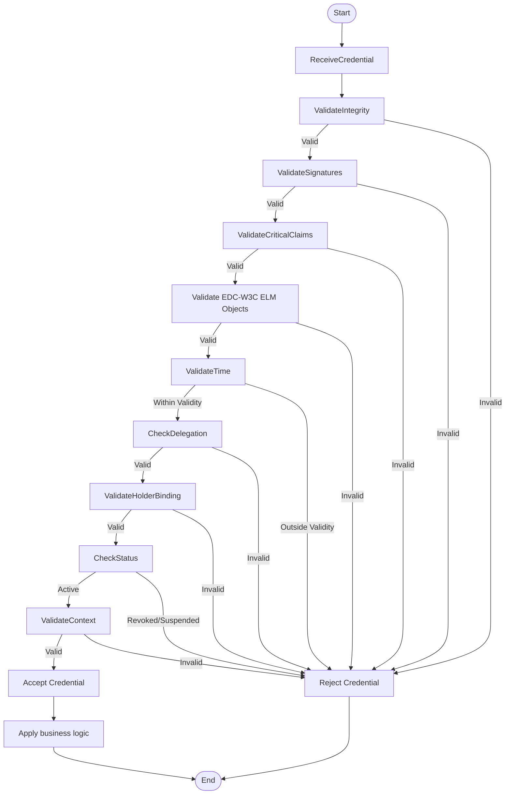

# Verification

## Overview

The verification process ensures credential validity while protecting privacy through a distributed system that avoids single points of failure. This approach balances security needs with privacy protection, preventing unnecessary monitoring of credential usage.

## Key Characteristics

### Distributed Verification
- Avoids single points of failure
- Distributes trust across the ecosystem
- Maintains system resilience
- Prevents centralised control

### Privacy Protection
- Shields from issuer monitoring
- Prevents tracking of credential usage
- Protects user privacy
- Implements data minimisation

### Time-based Validation
- Links validation to credential issuance
- Supports expiration mechanisms
- Enables time-bound credentials
- Maintains temporal relevance

## Identity considerations
To check identity
     - Use X.509v3 - clasical PKI - to verify if it is an issuer/RP/RPI authorised to interact with the EUDIW
     - Use DID - decentralized PKI - to extend X.509v3 limitations and verify educational or professional qualifications governance/entitlement
     - If needed, use EAA catalogue to check embeded disclosure entitlement - if applies

## EAA embedded disclosure considerations
If needed, use EAA catalogue to check embeded disclosure entitlement

The verification process shall follow these steps:

## Verification Process

1. **Secure Wallet Connection**
   - Establish secure channel with the wallet
   - Verify requester/issuer identity 
   - Verify proof of possession
   - Authenticate the verification request
   - Create encrypted communication

2. **Credential Request**
   - Request specific credentials
   - Specify required attributes
   - Indicate purpose of verification
   - Apply data minimisation

3. **Integrity Verification**
   - Check cryptographic signatures
   - Validate hash integrity
   - Verify digital proofs
   - Ensure credential hasn't been tampered with

4. **Metadata Checking**
   - Verify expiration dates
   - Check issuance dates
   - Validate credential type
   - Confirm appropriate usage context

5. **Issuer Verification**
   - Digital identifier validation (X.509v3 or/and DID)
   - Educational accreditation checking (based on EAA authorisation model)
   - Accreditation issuer verification
   - Trust chain validation (CRLs or/and TRs)

6. **Identity Information Analysis**
   - Validate holder information
   - Check binding between credential and holder
   - Verify identity attributes when necessary
   - Apply appropriate identity assurance levels

7. **Schema Compliance Checking** 
   - Verify credential structure
   - Validate against schema definitions
   - Check required fields
   - Ensure proper formatting

8. **EAA Catalogue Compliance Checking - EDC-W3C-VC + ELM checking**
   - Validate against sectorial catalogue definitions
   - Verify ontology mandatory elements
     - E.g. HEEUMC mandatory objects:
       - 1 Achievement
         - Linked to the achievement:
           - Mandatory 1 Learing outcome 
             - Linked to the Learing outome:
               - 1 Competence
       - 1 assessment
       - But:
         - More Learning outcomes can be included
         - More Competences and/or Skills can be linked to a Learning outcome
   - Check required elements
   - Ensure proper formatting against related schemes

9.  **Quality Assurance Verification**
  (If shared credential includes/combines quality assurance related information)
   - Issuer entitlement checking
   - Expiration verification
   - Status checking
   - Quality framework alignment

1.  **Credential Status Verification**
   (If shared credential includes status related information)
   - Check for revocation and/or suspension
   - Verify revocation and/or suspension status
   - Validate current status
   - Confirm active status

2.  **Record Keeping (evidences)**
    - Maintain audit records
    - Document verification results
    - Store minimal verification evidence
    - Support future audit needs

## Visualisation

## Implementation Considerations

When implementing verification processes:
- Privacy protection should be built into all verification steps
- Verification should be efficient and responsive
- Error handling should be informative yet secure
- Technical performance should support large-scale verification
- Interoperability with different credential formats should be maintained

## Cross-Border Scenarios

For cross-border educational mobility, verification provides:
- Consistent validation across member states
- Recognition of credentials from different countries
- Support for qualification recognition
- Trust establishment across borders
