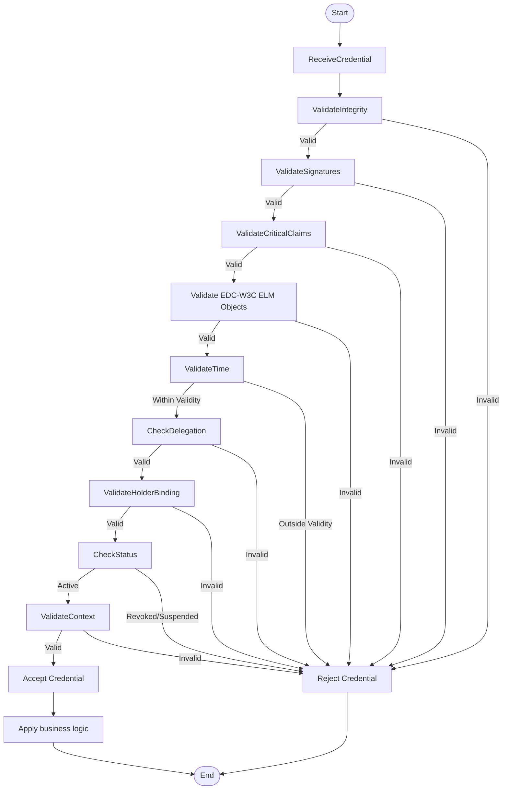

# Verification

## Overview

The verification process ensures credential validity while protecting privacy through a distributed system that avoids single points of failure. This approach balances security needs with privacy protection, preventing unnecessary monitoring of credential usage. For technical verification details read [Verification details](./verification-details.md) document.

## Key Characteristics

### Distributed Verification
- Avoids single points of failure
- Distributes trust across the ecosystem
- Maintains system resilience
- Prevents centralised control

### Privacy Protection
- Shields from issuer monitoring
- Prevents tracking of credential usage
- Protects user privacy
- Implements data minimisation

### Time-based Validation
- Links validation to credential issuance
- Supports expiration mechanisms
- Enables time-bound credentials
- Maintains temporal relevance

## Identity considerations
To check identity
- Use X.509v3 (clasical PKI) to verify if it is an issuer/RP/RPI authorised to interact with the EUDIW
- Use DID (decentralized PKI) to extend X.509v3 limitations and verify educational or professional qualifications governance/entitlement

## EAA embedded disclosure considerations
If needed, use EAA catalogue to check embeded disclosure entitlement (if applies)

## Verification Process
The verification process shall follow these steps:

1. **Secure Wallet Connection**
- Establish secure channel with the wallet
- Verify requester/issuer identity 
- Verify proof of possession
- Authenticate the verification request
- Create encrypted communication

2. **Credential Request**
- Request specific credentials
- Specify required attributes
- Indicate purpose of verification
- Apply data minimisation

3. **Integrity Verification**
- Check cryptographic signatures
- Validate hash integrity
- Verify digital proofs
- Ensure credential hasn't been tampered with

4. **Metadata Checking**
- Verify expiration dates
- Check issuance dates
- Validate credential type
- Confirm appropriate usage context

5. **Issuer Verification**
- Digital identifier validation (X.509v3 or/and DID)
- Educational accreditation checking (based on EAA authorisation model)
- Accreditation issuer verification
- Trust chain validation (CRLs or/and TRs)

6. **Identity Information Analysis**
- Validate holder information
- Check binding between credential and holder
- Verify identity attributes when necessary
- Apply appropriate identity assurance levels

7. **Schema Compliance Checking**
- Verify credential structure
- Validate against schema definitions (VC datamodel container: **W3C-VCDM** or SD-JWT-VCDM)
- Check required fields
- Ensure proper formatting
- The verifier MUST detect the profile by inspecting the `credentialSchema[]` array of the credential and apply the appropriate validation:
   - **7.a — VCDM 1.1 profile (mandatory per the 1st batch of eIDAS Implementing Acts).** `credentialSchema` contains a single entry of `type: JsonSchema`. Run syntactic JSON Schema validation against the referenced schema.
   - **7.b — VCDM 2.0 profile (optional, forward‑looking).** `credentialSchema` contains **two** entries: one of `type: JsonSchema` and one of `type: ShaclValidator2017`. The verifier MUST:
      1. Run the JSON Schema validation (as in 7.a) for the syntactic layer, and
      2. Materialise the RDF graph from the JSON‑LD (using the ELM v3.2 context) and run SHACL validation against the `ShaclValidator2017` shape for the semantic layer.
- Both the JSON Schema and, when present, the SHACL shape referenced from `credentialSchema[]` MUST resolve to entries in the EBSI Trusted Schemas Registry (v3).
- Verifiers SHOULD accept **both** profiles during the transition period in which the Implementing Acts still only mandate VCDM 1.1, and are expected to keep accepting both once future updates of those acts recognise VCDM 2.0 as well.

8. **EAA Catalogue Compliance Checking — EDC-W3C-VC + required/mandatory ELM objects/elements checking**
- Validate against sectorial catalogue definitions
   - Verify ontology mandatory elements
     - E.g. HEEUMC mandatory objects:
       - 1 Achievement
         - Linked to the achievement:
           - Mandatory 1 Learning outcome
             - Linked to the Learning outcome:
               - 1 Competence
       - 1 Assessment
       - But, take into account, that:
         - More Learning outcomes can be included
         - More Competences and/or Skills can be linked to a Learning outcome
- Check required elements
- Ensure proper formatting against related schemes
- **Profile note.** Under the **VCDM 1.1 profile** this ELM‑object check is performed as an additional, code‑driven step on top of the JSON Schema result (JSON Schema alone cannot express constraints like "at least one Achievement linked to one Learning Outcome linked to one Competence"). Under the **VCDM 2.0 profile** most of this ELM integrity checking is **enforced declaratively by the SHACL shape executed in step 7.b** — the catalogue's SHACL shapes encode the mandatory ELM cardinalities and relationships, so a VCDM 2.0 credential that passes SHACL has already satisfied the bulk of step 8 automatically. Step 8 then focuses on catalogue‑specific rules not expressible in SHACL (for instance cross‑credential coherence or references to external registries).

9.  **Quality Assurance Verification**
(If shared credential includes/combines quality assurance related information)
- Issuer entitlement checking
- Expiration verification
- Status checking
- Quality framework alignment

10.   **Credential Status Verification**
(If shared credential includes status related information)
- Check for revocation and/or suspension
- Verify revocation and/or suspension status
- Validate current status
- Confirm active status

11.   **Record Keeping (evidences)**
- Maintain audit records
- Document verification results
- Store minimal verification evidence
- Support future audit needs

## Visualisation

```mermaid
flowchart TD
  Start([Start])
  RC["ReceiveCredential"]
  VI["ValidateIntegrity"]
  VS["ValidateSignatures"]
  VC["ValidateCriticalClaims"]
  VE["Validate EDC-W3C ELM Objects"]
  VT["ValidateTime"]
  CD["CheckDelegation"]
  VB["ValidateHolderBinding"]
  CS["CheckStatus"]
  VX["ValidateContext"]
  AC["Accept Credential"]
  REJ["Reject Credential"]
  ABL["Apply business logic"]
  End([End])

  Start --> RC
  RC --> VI
  VI -->|Valid| VS
  VI -->|Invalid| REJ

  VS -->|Valid| VC
  VS -->|Invalid| REJ

  VC -->|Valid| VE
  VC -->|Invalid| REJ

  VE -->|Valid| VT
  VE -->|Invalid| REJ

  VT -->|Within Validity| CD
  VT -->|Outside Validity| REJ

  CD -->|Valid| VB
  CD -->|Invalid| REJ

  VB -->|Valid| CS
  VB -->|Invalid| REJ

  CS -->|Active| VX
  CS -->|Revoked/Suspended| REJ

  VX -->|Valid| AC
  VX -->|Invalid| REJ

  AC --> ABL --> End
  REJ --> End
```

## Implementation Considerations

When implementing verification processes:
- Privacy protection should be built into all verification steps
- Verification should be efficient and responsive
- Error handling should be informative yet secure
- Technical performance should support large-scale verification
- Interoperability with different credential formats should be maintained

## Cross-Border Scenarios

For cross-border educational mobility, verification provides:
- Consistent validation across member states
- Recognition of credentials from different countries
- Support for qualification recognition
- Trust establishment across borders
