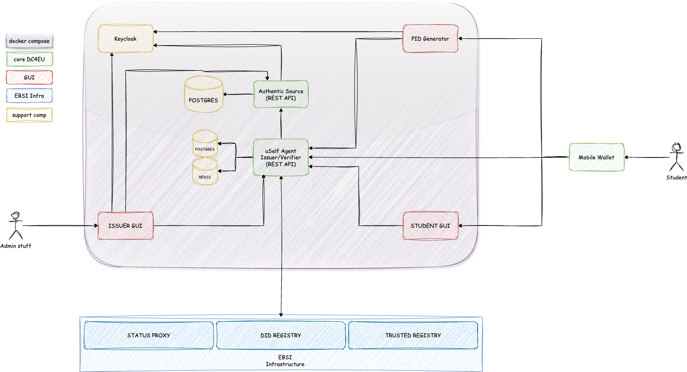

# Implementation Toolkits

## Overview

These toolkits provide the practical implementation guidance needed to develop user journeys and technical solutions based on the principles outlined in the [Sectorial Rulebook](../sectorial-rulebook/) and the data models defined in the [Sectorial EAA Rulebook](../sectorial-eaa-rulebook/).

## Components

### [Technical Architecture](./technical-architecture/)

This section describes the high-level technical architecture of the system, including:

- Core infrastructure components
- System interactions
- Deployment models
- Security architecture

### [Components](./components/)

Detailed descriptions of the main components from core technical infrastructure:

- Keycloak
- Status Web GUI
- PID Generator GUI
- Student Web GUI
- Issuer Agent
- Authentic Source
- [Natural Person Holder Wallet provided by IZERTIS](./wallet/README.md)
- EUDI Reference Wallet integration provided by GRNET 

### [Workflows (RFCs)](./workflows/)

Documentation of the basic operations implemented by the system in RFC format:

#### Approved RFCs

| **RFC #** | **RFC Title**                                                                                         |
|-----------|-------------------------------------------------------------------------------------------------------|
| RFC-001   | [Issue Verifiable Credentials Workflow - v1.0](./workflows/rfc001-issue-verifiable-credential.md)     |
| RFC-002   | [Present Verifiable Credentials Workflow - v1.0](./workflows/rfc002-present-verifiable-credential.md) |

#### Candidate RFCs (Work in progress)

| **RFC #** | **RFC Title**                                        |
|-----------|------------------------------------------------------|
| RFC-003   | [To be defined](./workflows/rfc003-to-be-defined.md) |

### [Use Cases](./use-cases/)

Specific use cases approved for implementation, organised by project:

#### DC4EU Project

| **Use Case #** | **Use Case Title**                                                                                              |
|----------------|-----------------------------------------------------------------------------------------------------------------|
| DC4EU-001      | [Issue a PID - v1.0](./use-cases/dc4eu/dc4eu-001-issue-pid.md)                                                  |
| DC4EU-002      | [Issue EducationalId using a PID for authentication - v1.0](./use-cases/dc4eu/dc4eu-002-issue-eudcationalId.md) |
| DC4EU-003      | [Issue a Diploma using a EducationalId for authentication - v1.0](./use-cases/dc4eu/dc4eu-003-issue-diploma.md) |
| DC4EU-004      | [Verify EducationalId for authentication - v1.0](./use-cases/dc4eu/dc4eu-004-verify-diploma.md)                 |

## Implementation Guidance

When implementing these toolkits:

1. Start by understanding the relevant use cases for your specific needs
2. Review the technical architecture to understand the system components
3. Follow the workflow RFCs to implement the basic operations
4. Ensure compliance with the data models from the Sectorial EAA Rulebook
5. Test against the compliance requirements outlined in the [Compliance](../compliance/) section

## Contributing

To contribute new use cases, workflows, or component descriptions, please follow the templates provided in each section and submit a pull request.

# License and Notice

Copyright � 2025 ATOS Spain S.A. (hereinafter referred to as "Atos" or "EVIDEN"). All rights reserved.

The content in this repository is copyrighted by ATOS Spain S.A. unless otherwise specified. The information can only be used by the beneficiaries of the EU funded DC4EU Project and only for the purposes of the integration activities of this project. Any other use is forbidden unless accepted in writing by ATOS.

For complete license details, see [License Information](./docs/license.md).