# Issuer admin Web GUI for DC4EU

The **Issuer admin Web** is a graphical user interface developed by **Atos** for the **DC4EU** project under Work Package 5 (Education and Professional Qualifications). It is designed for:

* Identify to the Issuer Administrator
* Verifying the issued credentials
* Issuing credentials
* Revoking status of the issued credentials
* Suspending/Restoring status of issued the credentials
* Accessing to the Authentic Source interface

All the functionalities provided for this component are in compliance with eIDAS 2.0, the EUDI Wallet ecosystem, and the W3C Verifiable Credentials standard.

## Key Features

### 1. Identify to the Issuer Administrator

The administrator needs to introduce his/her credentials in order to get identify by the system

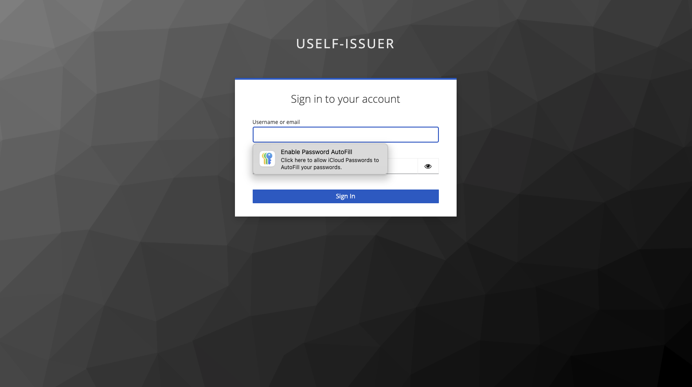

Once the administrator has been identified, the administrator can choose between the three main options described above.
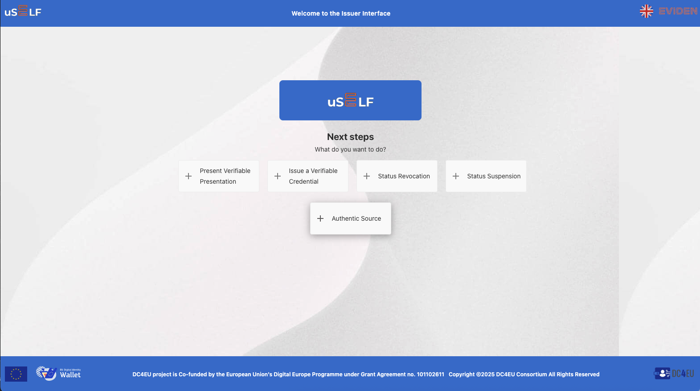
Then the administrator can select which operation to perform.

### 2. Verifying the issued credentials

By clicking in `+ Present Verifiable Credential` button, the admin can choose between the different credentials available in the system.

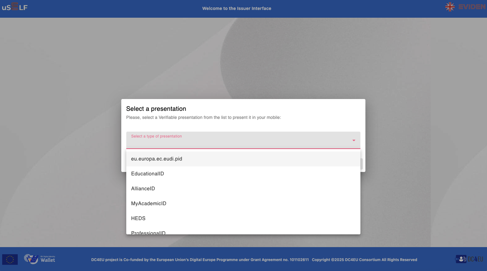

Then the student can select the desire type of credential to be presented and click on the `Accept` button. The system will generate a QRcode containing the credential offer associated.

Using the mobile app the admin can read the QRCode with his/her mobile app in order to verify the selected credential. Once the system verifies the verifiable credential presented by the admin will show a message:

* if the verifiable credential is valid:

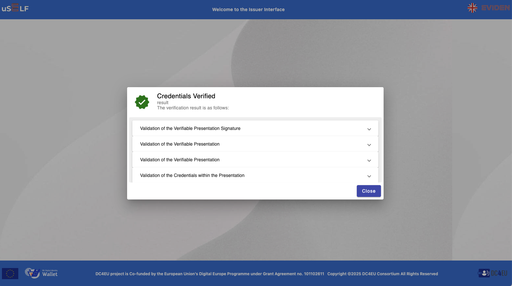

* if the verifiable credential is not valid:

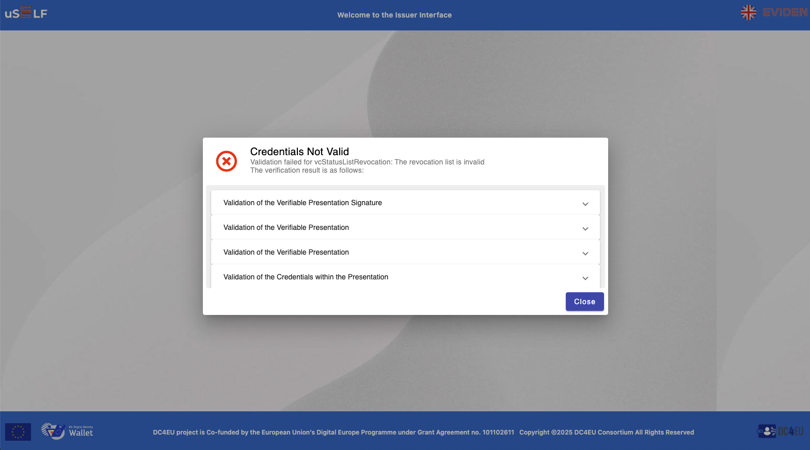

### 3. Issuing credentials

By clicking in `+ Issue Verifiable Credential` button, the admin can choose between the different credentials available in the system.

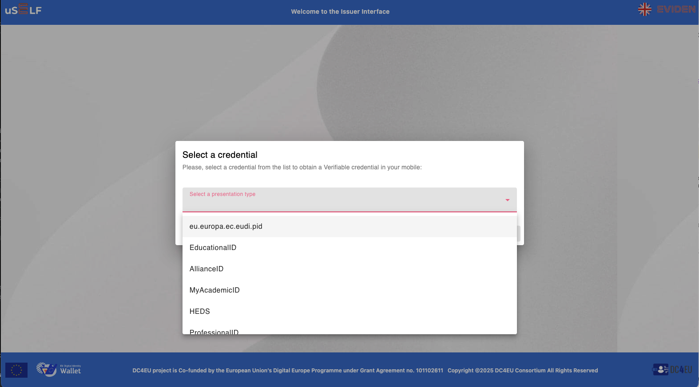

Then the admin can select the desire type of credential to be issued and click on the `Accept` button. The system will generate a QRcode containing the credential offer associated.

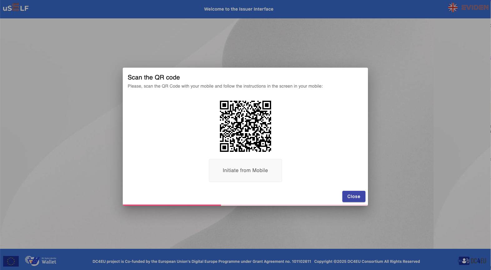

Using the mobile app the admin can read the QRCode with his/her mobile app in order to obtain the selected credential. Once the mobile app store the selected credential the system will show to the admin a summary of the verifiable credential issued by the system.

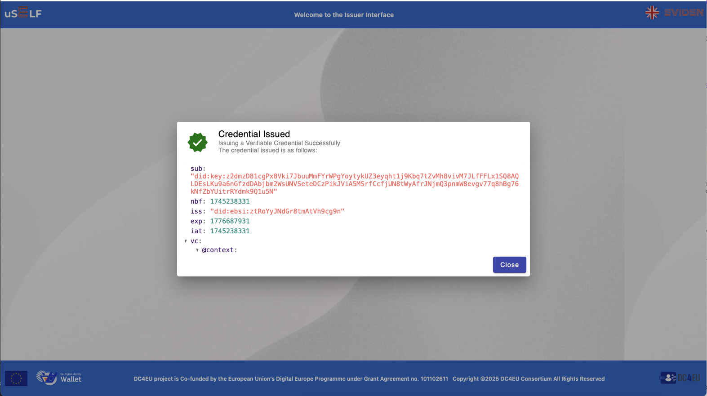

### 4. Revoking status of the issued credentials

By clicking in `+ Status Revocation` button, the admin can see a list of all the verifiable credentials issued by the system.

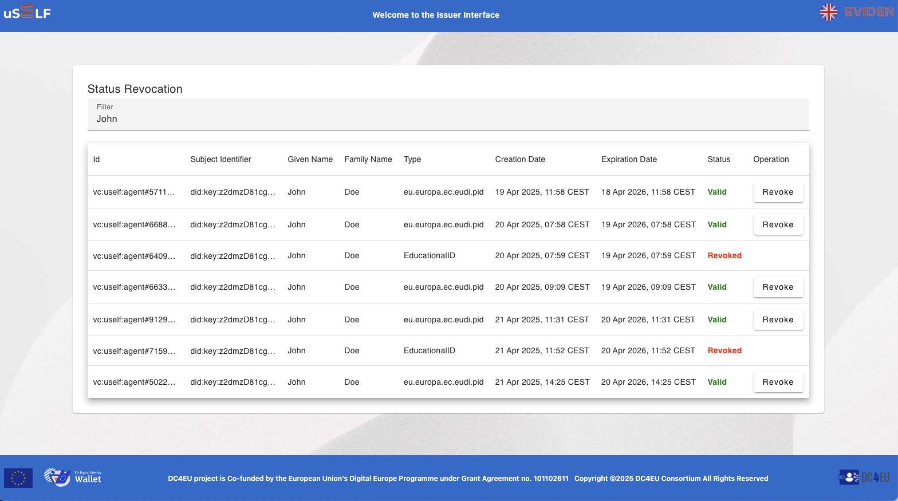

Where the administrator can filter the credentials he/she wants to select. Once the credential in question is selected, the administrator can revoke the verifiable credential just clicking in the `Revoke`button.

### 5. Suspending/Restoring status of issued the credentials

By clicking in `+ Status Suspension` button, the admin can see a list of all the verifiable credentials issued by the system.

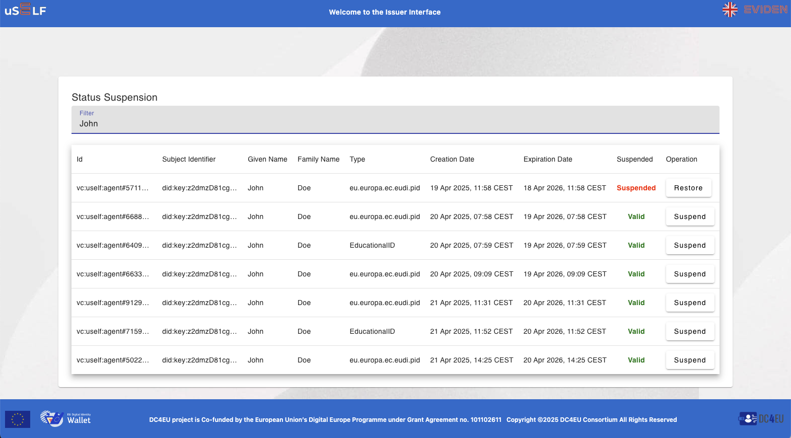

Where the administrator can filter the credentials he/she wants to select. Once the credential in question is selected, the administrator can revoke the verifiable credential just clicking in the `Suspend`button. On the other hand if the verifiable credential has been already suspended, the administrator can restore it, just clicking in the `Restore`button.

### 5. Accessing to the Authentic Source interface

The administrator, using hte credentials obtaining in the initial login into the system, can access to the Authentic Source interface for feeding the Authentic Source with new data or just to consult the data already into the system using a SWAGGER interface with the Create/Read/Update/Delete (CRUD) operations available for eah of the different credentials defined for this pilot in the [Sectorial EAA Catalogue for Education and Professional Qualifications](https://github.com/dc4eu/educational-pilot/tree/main/sectorial-eaa-catalogue)

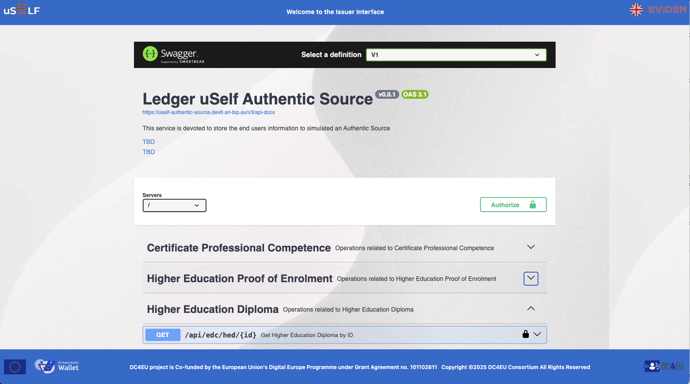

## Related EU Strategies and Standards

The **Issuer admin Web** aligns with:

- [eIDAS 2.0 Regulation](https://digital-strategy.ec.europa.eu/en/policies/eidas-regulation)
- [EUDI Wallet Architecture Reference Framework](https://ec.europa.eu/newsroom/dae/redirection/document/90784)
- [W3C Verifiable Credentials](https://www.w3.org/TR/vc-data-model/)
- [European Blockchain Services Infrastructure (EBSI)](https://ec.europa.eu/cefdigital/wiki/display/CEFDIGITAL/EBSI)

## License and Funding

Developed within the **DC4EU** project, co-funded by the **European Union’s Digital Europe Programme** under Grant Agreement No. **101102611**.
