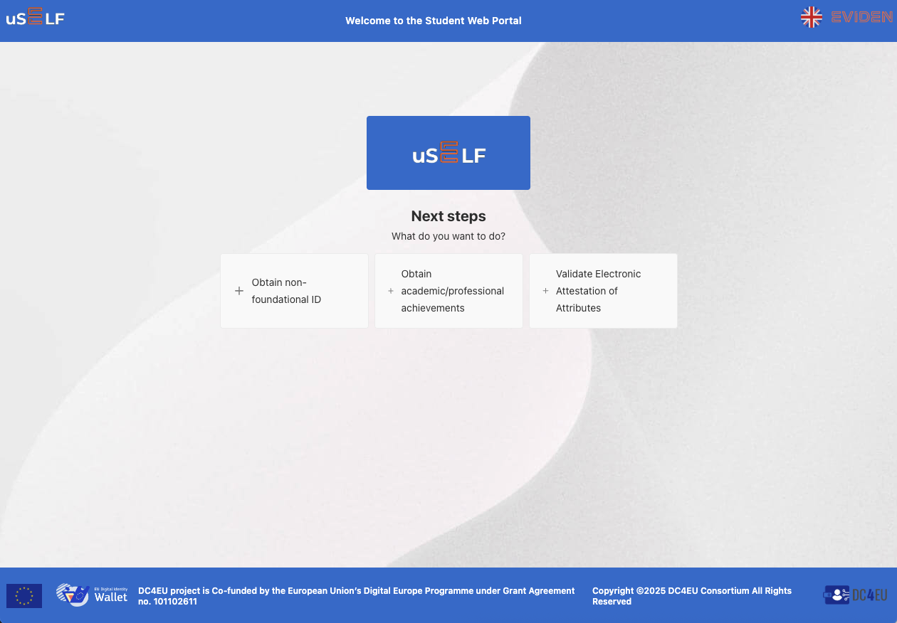
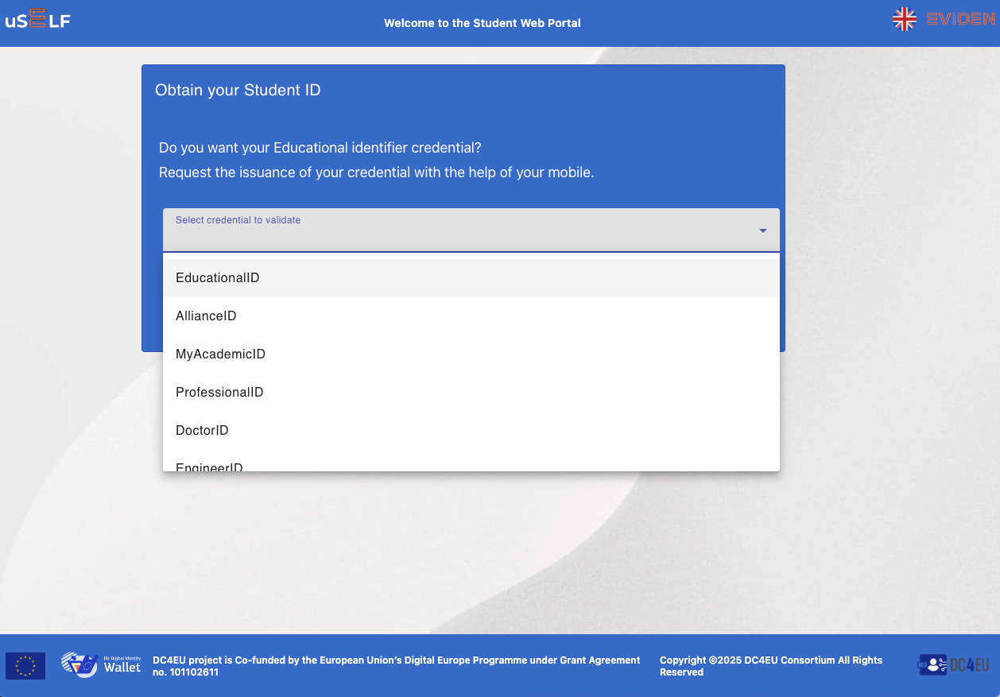
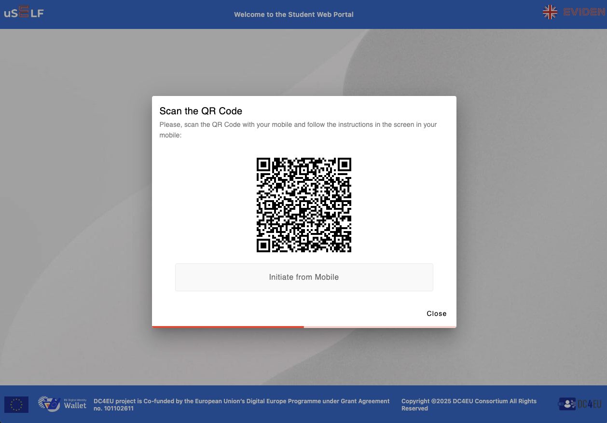
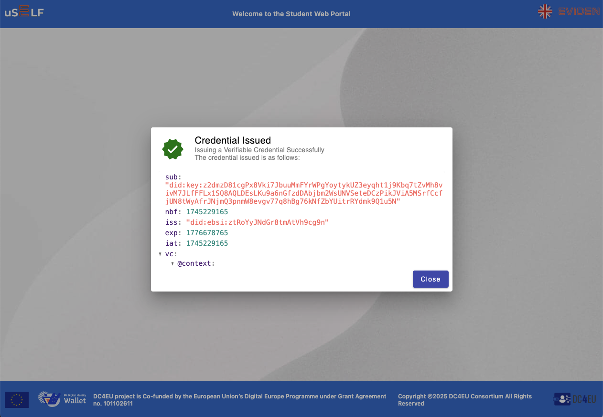
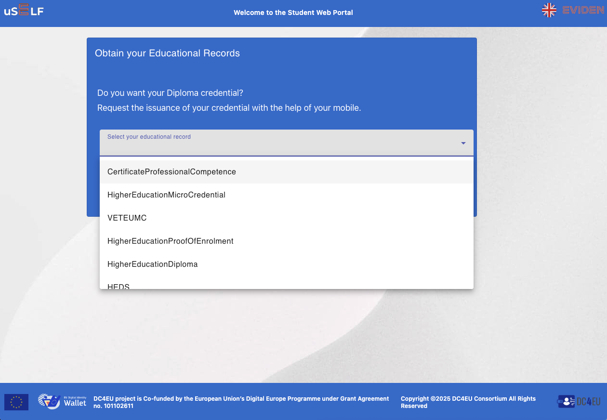
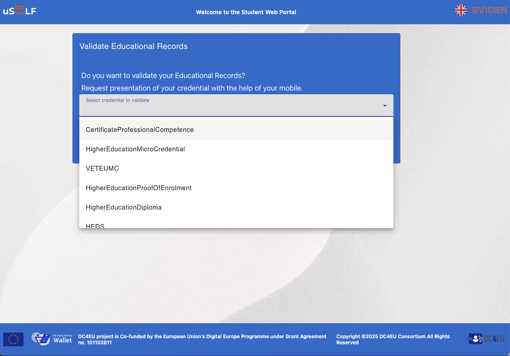
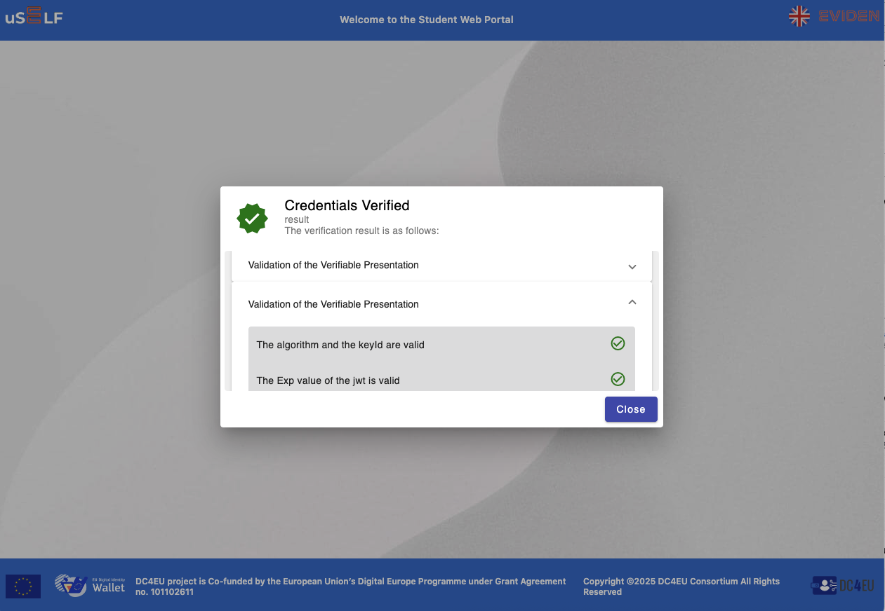
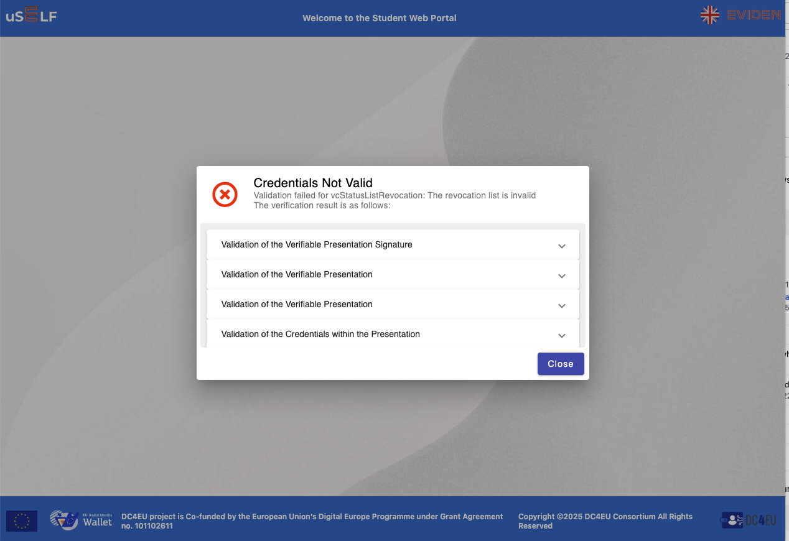

# Student Web GUI for DC4EU

The **Student Web** is a graphical user interface developed by **Atos** for the **DC4EU** project under Work Package 5 (Education and Professional Qualifications). It is designed for:

* issuing non foundational identifiers credentials
* issuing academic/professional achievements
* verifying the issued credentials on the previous steps

All the issued credentials provided are in compliance with eIDAS 2.0, the EUDI Wallet ecosystem, and the W3C Verifiable Credentials standard.

## Key Features

### 1. Student land in the welcome site

The student can choose between the three main options described above.

Then the student can select which operation to perform.

### 2. Issuing non foundational identifiers credentials

By clicking in `+ Obtain non-foundational ID` button, the student can choose between the different credentials available in the system.

Then the student can select the desire type of credential to be issued and click on the `Accept` button. The system will generate a QRcode containing the credential offer associated.

Using the mobile app the student can read the QRCode with his mobile app in order to obtain the selected credential. Once the mobile app store the selected credential the system will show to the student a summary of the verifiable credential issued by the system.

### 3. Issuing academic/professional achievements

By clicking in `+ Obtain academic/professional achievements` button, the student can choose between the different credentials available in the system.

Then the student can select the desire type of credential to be issued and click on the `Accept` button. The system will generate a QRcode containing the credential offer associated.

Using the mobile app the student can read the QRCode with his mobile app in order to obtain the selected credential. Once the mobile app store the selected credential the system will show to the student a summary of the verifiable credential issued by the system.

### 4. Verifying the issued credentials on the previous steps

By clicking in `+ Validate Electronic Attestations of Attributes` button, the student can choose between the different credentials available in the system.

Then the student can select the desire type of credential to be issued and click on the `Accept` button. The system will generate a QRcode containing the credential offer associated.

Using the mobile app the student can read the QRCode with his mobile app in order to verify the selected credential. Once the system verifies the verifiable credential presented by the student will show a message:

* if the verifiable credential is valid:

* if the verifiable credential is not valid:

## Related EU Strategies and Standards

The **Student Web** aligns with:

- [eIDAS 2.0 Regulation](https://digital-strategy.ec.europa.eu/en/policies/eidas-regulation)
- [EUDI Wallet Architecture Reference Framework](https://ec.europa.eu/newsroom/dae/redirection/document/90784)
- [W3C Verifiable Credentials](https://www.w3.org/TR/vc-data-model/)
- [European Blockchain Services Infrastructure (EBSI)](https://ec.europa.eu/cefdigital/wiki/display/CEFDIGITAL/EBSI)

## License and Funding

Developed within the **DC4EU** project, co-funded by the **European Union’s Digital Europe Programme** under Grant Agreement No. **101102611**.
