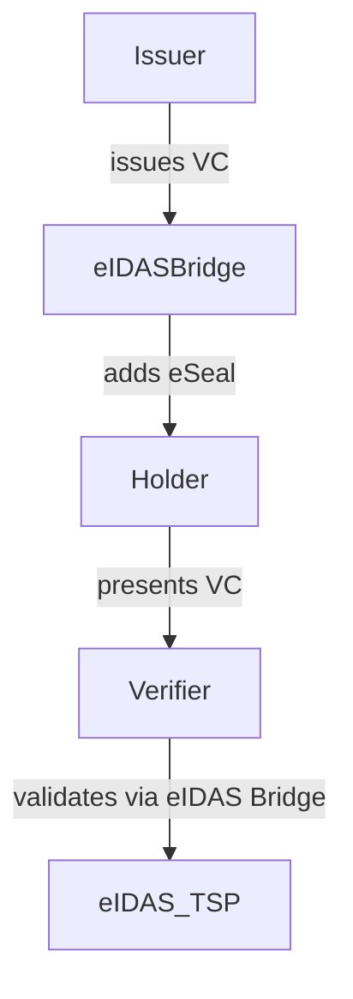

# eIDAS Bridge - Connecting SSI & eIDAS Trust Framework

The **eIDAS Bridge** is a middleware solution that connects **Self-Sovereign Identity (SSI)** with **eIDAS trust services**, ensuring **legal validity and cross-border recognition** of **Verifiable Credentials (VCs)** in the **European Single Digital Market**.

## Key Features
- **Electronic Sealing of Verifiable Credentials** 
- **Verification of eIDAS-Sealed Credentials** 
- **Integration with Decentralized Identifiers (DIDs)** 
- **Interoperability with the eIDAS Framework** 

## Why Use eIDAS Bridge?
- Adds **legal trustworthiness** to **SSI-based digital identity**.
- Ensures compliance with **eIDAS Regulation (EU) No 910/2014**.
- Supports **European Digital Identity Wallets (EUDI)**.

## Technical Overview
The eIDAS Bridge is based on:
- **Decentralized Identifiers (DIDs)**
- **Qualified Electronic Seals (QES)**
- **European Blockchain Services Infrastructure (EBSI)**
- **Trust Service Providers (QTSPs)**

## Architecture
The eIDAS Bridge enables **issuers** (e.g., universities, governments) to seal credentials and **verifiers** to validate them.

