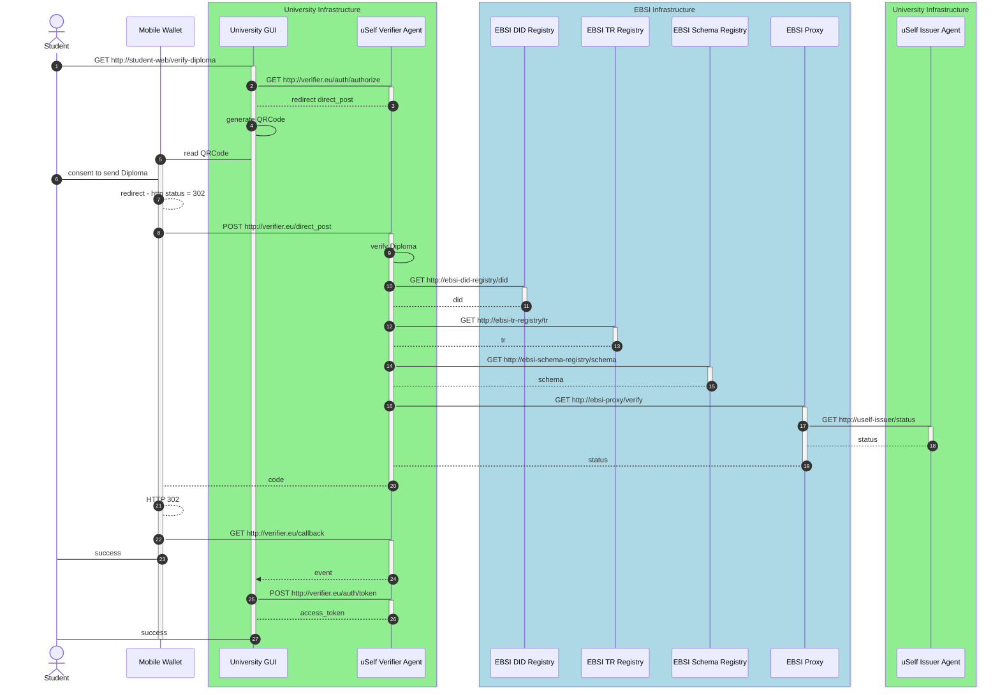

# Verify Diploma - v1.0

**Authors:**

* Angel Palomares (<angel.palomares@eviden.com>)

**Reviewers:**

* LLuis Ariño (lluisalfons.arino@urv.cat)


**Status:** Approved for v1.0

**Table of Contents:**

* [1 Summary](#1-summary)
* [2 Verification Flow](#2-verification-flow)
* [3 Message Details](#3-message-details)
  * [3.1 Authorization request](#31-authentication-request-authorize)
  * [3.2 Authorization response](#32-authentication-response-direct_post)
  * [3.3 Trigger Callback](#33-trigger-callback-callback)
  * [3.4 Obtain Token](#34-obtain-access-token-token)
* [4 References](#4-references)

## [1 Summary](#1-summary)

This section describes in detail the different steps that an student has to perform in order to send a verifiable presentation including his/her diploma. This details are aligned with the [OpenID for Verifiable Presentations (OID4VP)' Draft 14](https://openid.net/specs/openid-4-verifiable-presentations-1_0-14.html)

## [2 Verification Flow](#2-verification-flow)

Figure 1 shows when the detailed flow:



          Figure 1: Verification Flow with a Relaying Party with a Front End and a Back End

## [3 Message Details](#3-message-details)

### [3.1 Authentication Request `/authorize`](#31-authentication-request-authorize)

#### 3.1.1 Request

The University Graphical Interface will execute the authorization request with the specific parameters for obtaining the Diploma. An example of how to invoke this request is as follows:
```http
GET https://verifier.com/authorize?
  &client_id=https://verifier.com
  &response_type=code
  &redirect_uri=https://verifier.eu/auth/callback
  &scope=openid CertificateProfessionalCompetence
  &response_uri=https://verifier.com/direct_post
  &response_mode=direct_post
  &state=8d8b6a3d-4bc0-4234-9a9a-ed1928815502
  &nonce=d527c191-6e1d-4c3d-9843-9eaf2005fba9
```

#### 3.1.2 Response

In order to obtain a compact QR Code and therefore easier to be read by the mobile is recommended to response with a `request_uri` which means the authorization request is presented by reference. The Request URI has to be resolved to obtain the JWT, which contains the above fields in the claims. An example is as given below:

```bash
HTTP 302 Location: openid://?request_uri=https://verifier.com/request_uri/a044aea-275d-43d6-8ec4-0ae88df46256
```

The reference as defined in JWT-Secured Authorization Request (JAR) via use of `request_uri` [3]. The custom URL scheme for authorization requests is `openid://`. An  example of the JAR object responded by the verifier is as given below:

```http

 eyJraWQiOiJkaWQ6ZWJzaTp6dFJvWXlKTmRHcjh0bUF0Vmg5Y2c5biIsInR5cCI6IkpXVCIsImFsZyI6IkVTMjU2In0.eyJpc3MiOiJkaWQ6ZWJzaTp6dFJvWXlKTmRHcjh0bUF0Vmg5Y2c5biIsInJlc3BvbnNlX3R5cGUiOiJ2cF90b2tlbiIsIm5vbmNlIjoiZDU5YjE1YTAtMWY4NS00NzMzLWI0OWYtZGJhNGU2NjhjMjRjIiwiY2xpZW50X2lkIjoiaHR0cHM6Ly90YWRwb2xlLWludGVybmFsLW1hbW1hbC5uZ3Jvay1mcmVlLmFwcC9hdXRoIiwicmVzcG9uc2VfbW9kZSI6ImRpcmVjdF9wb3N0IiwiYXVkIjoiaHR0cHM6Ly90YWRwb2xlLWludGVybmFsLW1hbW1hbC5uZ3Jvay1mcmVlLmFwcC9hdXRoIiwic2NvcGUiOiJvcGVuaWQiLCJwcmVzZW50YXRpb25fZGVmaW5pdGlvbiI6eyJpZCI6ImhvbGRlci13YWxsZXQtcXVhbGlmaWNhdGlvbi1wcmVzZW50YXRpb24iLCJmb3JtYXQiOnsiand0X3ZwX2pzb24iOnsiYWxnIjpbIkVTMjU2Il19LCJqd3RfdnAiOnsiYWxnIjpbIkVTMjU2Il19LCJqd3RfdmNfanNvbiI6eyJhbGciOlsiRVMyNTYiXX0sImp3dF92YyI6eyJhbGciOlsiRVMyNTYiXX19LCJpbnB1dF9kZXNjcmlwdG9ycyI6W3siaWQiOiI1MTE1ODk4MzA1MDE5ODgyMTA2IiwibmFtZSI6ImhvbGRlci13YWxsZXQtcXVhbGlmaWNhdGlvbi1wcmVzZW50YXRpb24gb2YgQ2VydGlmaWNhdGVQcm9mZXNzaW9uYWxDb21wZXRlbmNlIiwicHVycG9zZSI6IlRoaXMgaXMgYSBwcmVzZW50YXRpb24gZGVmaW5pdGlvbiBmb3IgdGhlIGhvbGRlciB3YWxsZXQgcXVhbGlmaWNhdGlvbiIsImZvcm1hdCI6eyJqd3RfdmMiOnsiYWxnIjpbIkVTMjU2Il19fSwiY29uc3RyYWludHMiOnsiZmllbGRzIjpbeyJwYXRoIjpbIiQudmMudHlwZSJdLCJmaWx0ZXIiOnsidHlwZSI6ImFycmF5IiwiY29udGFpbnMiOnsiY29uc3QiOiJDZXJ0aWZpY2F0ZVByb2Zlc3Npb25hbENvbXBldGVuY2UifX19XX19XX0sInJlZGlyZWN0X3VyaSI6Imh0dHBzOi8vdGFkcG9sZS1pbnRlcm5hbC1tYW1tYWwubmdyb2stZnJlZS5hcHAvYXV0aC9kaXJlY3RfcG9zdCIsInN0YXRlIjoiMWY5MjU3YzQtYjA3NC00ZWQ4LWIxN2UtNzBlZjM0Y2RlNWZiIiwiZXhwIjoxNzQxMDEzNTIwLCJpYXQiOjE3NDEwMTI5MjB9.kG8jviNYHs776P-EMQtyolbWRoTmt7Xt6qXrfjA2Hl_2qE23OoG42IrBeTNrfFK59MLa9sdKKypiHLeEefojBw

```

### [3.2 Authentication Response `/direct_post`](#32-authentication-response-direct_post)

#### 3.2.1 Request

Once the Mobile Wallet had obtained the Authorization details, it can send to the verifier a verifiable presentation containing the diploma solicited by the Verifier. An example of this request is as follows:

```http
POST https://verifier.com/direct_post
Content-Type: application/x-www-form-urlencoded


vp_token=eyJhbGciOiJFUzI1NiIsInR5cCI6IkpXVCIsImtpZCI6ImRpZDprZXk6ejJkbXpEODFjZ1B4OFZraTdKYnV1TW1GWXJXUGdZb3l0eWtVWjNleXFodDFqOUticzVpc0Uyc0pjWk1oaFpyOUN4UHVBOVBqNXFQNk5uU0pmTVhnS3RQZWdNRG53eXc2ODh3QjJCc1VmazNnSlJBMnFnUWNVRGttVE5wRHJYNjhwRFlzZE1hS3EzV29Tc1JqdGN3WXBzYVh1MkVFVVdFTkZEMTMxZVdYc0VDN3F0cGRrZyN6MmRtekQ4MWNnUHg4VmtpN0pidXVNbUZZcldQZ1lveXR5a1VaM2V5cWh0MWo5S2JzNWlzRTJzSmNaTWhoWnI5Q3hQdUE5UGo1cVA2Tm5TSmZNWGdLdFBlZ01Ebnd5dzY4OHdCMkJzVWZrM2dKUkEycWdRY1VEa21UTnBEclg2OHBEWXNkTWFLcTNXb1NzUmp0Y3dZcHNhWHUyRUVVV0VORkQxMzFlV1hzRUM3cXRwZGtnIn0.eyJub25jZSI6ImQ1OWIxNWEwLTFmODUtNDczMy1iNDlmLWRiYTRlNjY4YzI0YyIsInN0YXRlIjoiMWY5MjU3YzQtYjA3NC00ZWQ4LWIxN2UtNzBlZjM0Y2RlNWZiIiwidnAiOnsiQGNvbnRleHQiOlsiaHR0cHM6Ly93d3cudzMub3JnLzIwMTgvY3JlZGVudGlhbHMvdjEiXSwiaWQiOiJ1cm46dXVpZDozMzdhNjY5Ny00MGU3LTQxZTYtYjc3MC1mOGE3OGFlNjAwMDYiLCJ0eXBlIjpbIlZlcmlmaWFibGVQcmVzZW50YXRpb24iXSwiaG9sZGVyIjoiZGlkOmtleTp6MmRtekQ4MWNnUHg4VmtpN0pidXVNbUZZcldQZ1lveXR5a1VaM2V5cWh0MWo5S2JzNWlzRTJzSmNaTWhoWnI5Q3hQdUE5UGo1cVA2Tm5TSmZNWGdLdFBlZ01Ebnd5dzY4OHdCMkJzVWZrM2dKUkEycWdRY1VEa21UTnBEclg2OHBEWXNkTWFLcTNXb1NzUmp0Y3dZcHNhWHUyRUVVV0VORkQxMzFlV1hzRUM3cXRwZGtnIiwidmVyaWZpYWJsZUNyZWRlbnRpYWwiOlsiZXlKcmFXUWlPaUprYVdRNlpXSnphVHA2ZEZKdldYbEtUbVJIY2poMGJVRjBWbWc1WTJjNWJpSXNJblI1Y0NJNklrcFhWQ0lzSW1Gc1p5STZJa1ZUTWpVMkluMC5leUp6ZFdJaU9pSmthV1E2YTJWNU9ub3laRzE2UkRneFkyZFFlRGhXYTJrM1NtSjFkVTF0UmxseVYxQm5XVzk1ZEhsclZWb3paWGx4YUhReGFqbExZbk0xYVhORk1uTktZMXBOYUdoYWNqbERlRkIxUVRsUWFqVnhVRFpPYmxOS1prMVlaMHQwVUdWblRVUnVkM2wzTmpnNGQwSXlRbk5WWm1zelowcFNRVEp4WjFGalZVUnJiVlJPY0VSeVdEWTRjRVJaYzJSTllVdHhNMWR2VTNOU2FuUmpkMWx3YzJGWWRUSkZSVlZYUlU1R1JERXpNV1ZYV0hORlF6ZHhkSEJrYTJjaUxDSnVZbVlpT2pFM05ERXdNVEU1T1RRc0ltbHpjeUk2SW1ScFpEcGxZbk5wT25wMFVtOVplVXBPWkVkeU9IUnRRWFJXYURsalp6bHVJaXdpWlhod0lqb3hOemN5TkRZeE5UazBMQ0pwWVhRaU9qRTNOREV3TVRFNU9UUXNJblpqSWpwN0lrQmpiMjUwWlhoMElqcGJJbWgwZEhCek9pOHZkM2QzTG5jekxtOXlaeTh5TURFNEwyTnlaV1JsYm5ScFlXeHpMM1l4SWwwc0luUjVjR1VpT2xzaVZtVnlhV1pwWVdKc1pVTnlaV1JsYm5ScFlXd2lMQ0pEWlhKMGFXWnBZMkYwWlZCeWIyWmxjM05wYjI1aGJFTnZiWEJsZEdWdVkyVWlYU3dpYVdRaU9pSjJZenAxYzJWc1pqcGhaMlZ1ZENNMk1UWTNNakkwTWpFek56WXdOREE1TlRBMElpd2lhWE56ZFdWa0lqb2lNakF5TlMwd015MHdNMVF4TkRveU5qb3pORm9pTENKMllXeHBaRVp5YjIwaU9pSXlNREkxTFRBekxUQXpWREUwT2pJMk9qTTBXaUlzSW1OeVpXUmxiblJwWVd4VFkyaGxiV0VpT25zaWFXUWlPaUpvZEhSd2N6b3ZMMkZ3YVMxamIyNW1iM0p0WVc1alpTNWxZbk5wTG1WMUwzUnlkWE4wWldRdGMyTm9aVzFoY3kxeVpXZHBjM1J5ZVM5Mk1pOXpZMmhsYldGekwzb3pUV2RWUmxWcllqY3lNblZ4TkhnelpIWTFlVUZLYlc1T2JYcEVSbVZMTlZWRE9IZzRNMUZ2WlV4S1RTSXNJblI1Y0dVaU9pSkdkV3hzU25OdmJsTmphR1Z0WVZaaGJHbGtZWFJ2Y2pJd01qRWlmU3dpZEdWeWJYTlBabFZ6WlNJNmV5SnBaQ0k2SW1oMGRIQnpPaTh2WVhCcExYQnBiRzkwTG1WaWMya3VaWFV2ZEhKMWMzUmxaQzFwYzNOMVpYSnpMWEpsWjJsemRISjVMM1kxTDJsemMzVmxjbk12Wkdsa09tVmljMms2ZW5SU2IxbDVTazVrUjNJNGRHMUJkRlpvT1dObk9XNHZZWFIwY21saWRYUmxjeTlqTjJNek9UZzBZMkpsWXpVek1HUTRaR0U1TTJJeVl6VTJNR1poTmpnNVpqWXpOREJrT1dZMU5tTTRNemsyWkdVNVltTTVZMlU0WkdFd1lUWXdPVEpqSWl3aWRIbHdaU0k2SWtsemMzVmhibU5sUTJWeWRHbG1hV05oZEdVaWZTd2lhWE56ZFdWeUlqb2laR2xrT21WaWMyazZlblJTYjFsNVNrNWtSM0k0ZEcxQmRGWm9PV05uT1c0aUxDSnBjM04xWVc1alpVUmhkR1VpT2lJeU1ESTFMVEF6TFRBelZERTBPakkyT2pNMFdpSXNJbVY0Y0dseVlYUnBiMjVFWVhSbElqb2lNakF5Tmkwd015MHdNbFF4TkRveU5qb3pORm9pTENKamNtVmtaVzUwYVdGc1UzVmlhbVZqZENJNmV5SnBaQ0k2SW1ScFpEcHJaWGs2ZWpKa2JYcEVPREZqWjFCNE9GWnJhVGRLWW5WMVRXMUdXWEpYVUdkWmIzbDBlV3RWV2pObGVYRm9kREZxT1V0aWN6VnBjMFV5YzBwaldrMW9hRnB5T1VONFVIVkJPVkJxTlhGUU5rNXVVMHBtVFZoblMzUlFaV2ROUkc1M2VYYzJPRGgzUWpKQ2MxVm1hek5uU2xKQk1uRm5VV05WUkd0dFZFNXdSSEpZTmpod1JGbHpaRTFoUzNFelYyOVRjMUpxZEdOM1dYQnpZVmgxTWtWRlZWZEZUa1pFTVRNeFpWZFljMFZETjNGMGNHUnJaeUlzSW5CbGNuTnZibUZzWDJGa2JXbHVhWE4wY21GMGFYWmxYMjUxYldKbGNpSTZJakV5TXpRMU5qYzRPU0lzSW1kcGRtVnVYMjVoYldVaU9pSktiMmh1SWl3aVptRnRhV3g1WDI1aGJXVWlPaUpFYjJVaUxDSnBjMTlsYm5ScGRHeGxaQ0k2SW5SeWRXVWlmU3dpWTNKbFpHVnVkR2xoYkZOMFlYUjFjeUk2ZXlKMGVYQmxJam9pVTNSaGRIVnpUR2x6ZERJd01qRkZiblJ5ZVNJc0ltbGtJam9pYUhSMGNITTZMeTkwWVdSd2IyeGxMV2x1ZEdWeWJtRnNMVzFoYlcxaGJDNXVaM0p2YXkxbWNtVmxMbUZ3Y0M5emRHRjBkWE12ZGpFak1DSXNJbk4wWVhSMWMweHBjM1JKYm1SbGVDSTZJakFpTENKemRHRjBkWE5NYVhOMFEzSmxaR1Z1ZEdsaGJDSTZJbWgwZEhCek9pOHZkR0ZrY0c5c1pTMXBiblJsY201aGJDMXRZVzF0WVd3dWJtZHliMnN0Wm5KbFpTNWhjSEF2YzNSaGRIVnpMM1l4SWl3aWMzUmhkSFZ6VUhWeWNHOXpaU0k2SW5KbGRtOWpZWFJwYjI0aWZYMHNJbXAwYVNJNkluWmpPblZ6Wld4bU9tRm5aVzUwSXpZeE5qY3lNalF5TVRNM05qQTBNRGsxTURRaWZRLkhTeWQ4Tm9wS2JCa0lfbW9YSlAwWFoxLVJYc2VnLWdwSGNIbHhJOVQtaTFFUWk3Tm5XOTZyQS1JajdzeFM3dkhDS2RoZ0pCMGZlV1ZoX1NxNzNma2FRIl19LCJpYXQiOjE3NDEwMTI5NTIsImlzcyI6ImRpZDprZXk6ejJkbXpEODFjZ1B4OFZraTdKYnV1TW1GWXJXUGdZb3l0eWtVWjNleXFodDFqOUticzVpc0Uyc0pjWk1oaFpyOUN4UHVBOVBqNXFQNk5uU0pmTVhnS3RQZWdNRG53eXc2ODh3QjJCc1VmazNnSlJBMnFnUWNVRGttVE5wRHJYNjhwRFlzZE1hS3EzV29Tc1JqdGN3WXBzYVh1MkVFVVdFTkZEMTMxZVdYc0VDN3F0cGRrZyIsInN1YiI6ImRpZDprZXk6ejJkbXpEODFjZ1B4OFZraTdKYnV1TW1GWXJXUGdZb3l0eWtVWjNleXFodDFqOUticzVpc0Uyc0pjWk1oaFpyOUN4UHVBOVBqNXFQNk5uU0pmTVhnS3RQZWdNRG53eXc2ODh3QjJCc1VmazNnSlJBMnFnUWNVRGttVE5wRHJYNjhwRFlzZE1hS3EzV29Tc1JqdGN3WXBzYVh1MkVFVVdFTkZEMTMxZVdYc0VDN3F0cGRrZyIsImF1ZCI6Imh0dHBzOi8vdGFkcG9sZS1pbnRlcm5hbC1tYW1tYWwubmdyb2stZnJlZS5hcHAvYXV0aCIsIm5iZiI6MTc0MTAxMjk1MiwiZXhwIjoxNzQxMDEzODUyfQ.tLXvySWMeCJtWuT8WiP30bZHJ68WJ42UzAnx0jw85yXHeuwnFgWv9DaiFm-nQh_BSVWbd0wazqs0b6QEnWlHKA
&presentation_submission="{\"id\":\"f5932c81-f3bc-4d04-90bf-1cdb6bb23a7e\",\"definition_id\":\"holder-wallet-qualification-presentation\",\"descriptor_map\":[{\"id\":\"5115898305019882106\",\"path\":\"$\",\"format\":\"jwt_vp\",\"path_nested\":{\"id\":\"5115898305019882106\",\"format\":\"jwt_vc\",\"path\":\"$.vp.verifiableCredential[0]\"}}]}"
&state=1f9257c4-b074-4ed8-b17e-70ef34cde5fb

```

#### 3.2.2 Response

The Verifier, after validating that the verifiable presentation is valid and it complies with all the trust model requirements answer with the code. An example of this response is as follows:

```sh
HTTP 302 Location: https://verifier.com/callback?code=6577180341307828641&state=1f9257c4-b074-4ed8-b17e-70ef34cde5fb
```

### [3.3 Trigger Callback `/callback`](#33-trigger-callback-callback)

The Mobile Wallet will, following the redirection response, request the callback. In our case we have considered two different scenarios: when the Relaying Party has only one Front End (Figure 1)

#### 3.3.1 Request

An example for the use case described in the Figure 1 is as follows:
```http
GET https://verifier.com/callback?
  &code=6577180341307828641
  &client_id=https://verifier.eu
```


### [3.4 Obtain Access Token `/token`](#34-obtain-access-token-token)

As mentioned above this request can be executed by the Front End or by the Back End depending the specific case. However the details or both cases will be the same and they as follows:

#### 3.4.1 Request

```http
POST https://verifier.com/token
Content-Type: application/x-www-form-urlencoded

&grant_type=authorization_code,
&code=6577180341307828641
&client_id=https://verifier.eu

```

#### 3.4.2 Response

```http
{
   "access_token":"eyJraWQiOiJkaWQ6ZWJzaTp6dFJvWXlKTmRHcjh0bUF0Vmg5Y2c5biIsInR5cCI6IkpXVCIsImFsZyI6IkVTMjU2In0.eyJhdWQiOiJodHRwczovL3RhZHBvbGUtaW50ZXJuYWwtbWFtbWFsLm5ncm9rLWZyZWUuYXBwL2lzc3VlciIsInN1YiI6Imh0dHA6Ly91c2VsZi1pc3N1ZXItZ3VpLmxvY2FsaG9zdCIsImlzcyI6Imh0dHBzOi8vdGFkcG9sZS1pbnRlcm5hbC1tYW1tYWwubmdyb2stZnJlZS5hcHAvYXV0aCIsImNsYWltcyI6eyJjTm9uY2UiOiI3ODAyNDA3MzA4NTQ5NzUxNTMxIiwiY05vbmNlRXhwaXJlc0luIjoxNzQxMDEzNTU0MTQ5LCJjbGllbnRJZCI6Imh0dHA6Ly91c2VsZi1pc3N1ZXItZ3VpLmxvY2FsaG9zdCIsInVzZXJJbmZvIjp7ImZhbWlseV9uYW1lIjoiRG9lIiwiZ2l2ZW5fbmFtZSI6IkpvaG4iLCJpZCI6ImRpZDprZXk6ejJkbXpEODFjZ1B4OFZraTdKYnV1TW1GWXJXUGdZb3l0eWtVWjNleXFodDFqOUticzVpc0Uyc0pjWk1oaFpyOUN4UHVBOVBqNXFQNk5uU0pmTVhnS3RQZWdNRG53eXc2ODh3QjJCc1VmazNnSlJBMnFnUWNVRGttVE5wRHJYNjhwRFlzZE1hS3EzV29Tc1JqdGN3WXBzYVh1MkVFVVdFTkZEMTMxZVdYc0VDN3F0cGRrZyIsImlzX2VudGl0bGVkIjoidHJ1ZSIsInBlcnNvbmFsX2FkbWluaXN0cmF0aXZlX251bWJlciI6IjEyMzQ1Njc4OSJ9fSwiZXhwIjoxNzQxMDEzNTU0LCJpYXQiOjE3NDEwMTI5NTQsIm5vbmNlIjoiNzgwMjQwNzMwODU0OTc1MTUzMSJ9.T9JoTmPHHTW5TQ8eve35gJzjDb0M0sl-m4lg3ID43z8avDT0c_5P1zPKwyhE9ZeE4ohYDcdtNKa4fB95HhABKQ",
   "id_token":"eyJraWQiOiJkaWQ6ZWJzaTp6dFJvWXlKTmRHcjh0bUF0Vmg5Y2c5biIsInR5cCI6IkpXVCIsImFsZyI6IkVTMjU2In0.eyJzdWIiOiJodHRwOi8vdXNlbGYtaXNzdWVyLWd1aS5sb2NhbGhvc3QiLCJhdWQiOiJodHRwOi8vdXNlbGYtaXNzdWVyLWd1aS5sb2NhbGhvc3QiLCJ1c2VyX2luZm8iOnsiZmFtaWx5X25hbWUiOiJEb2UiLCJnaXZlbl9uYW1lIjoiSm9obiIsImlkIjoiZGlkOmtleTp6MmRtekQ4MWNnUHg4VmtpN0pidXVNbUZZcldQZ1lveXR5a1VaM2V5cWh0MWo5S2JzNWlzRTJzSmNaTWhoWnI5Q3hQdUE5UGo1cVA2Tm5TSmZNWGdLdFBlZ01Ebnd5dzY4OHdCMkJzVWZrM2dKUkEycWdRY1VEa21UTnBEclg2OHBEWXNkTWFLcTNXb1NzUmp0Y3dZcHNhWHUyRUVVV0VORkQxMzFlV1hzRUM3cXRwZGtnIiwiaXNfZW50aXRsZWQiOiJ0cnVlIiwicGVyc29uYWxfYWRtaW5pc3RyYXRpdmVfbnVtYmVyIjoiMTIzNDU2Nzg5In0sImlzcyI6Imh0dHBzOi8vdGFkcG9sZS1pbnRlcm5hbC1tYW1tYWwubmdyb2stZnJlZS5hcHAvYXV0aCIsImV4cCI6MTc0MTAxMzU1NCwiaWF0IjoxNzQxMDEyOTU0LCJub25jZSI6Ijc4MDI0MDczMDg1NDk3NTE1MzEifQ.2Fju3eZMCpsNkd6sTxpExGeYF0CQ3EzBa_dxdT8k74lnP5zfsw1nKQKJR00rdg6OaolDHSHQzEJ_t50wC_OQmw",
   "token_type":"Bearer",
   "expires_in":1741013554149,
   "c_nonce":"7802407308549751531",
   "c_nonce_expires_in":1741013554149
}
```
 
Once the University GUI receive this token information will be available for subsequence request to the back end, allowing to the back-end to authorize the request using the access_token provided.

## [4 References](#4-references)

1. [OpenID for Verifiable Presentations (OID4VP)' Draft 14](https://openid.net/specs/openid-4-verifiable-presentations-1_0-14.html)
2. [The European Digital Identity Wallet Architecture and Reference Framework (v1.4.0)](https://github.com/eu-digital-identity-wallet/eudi-doc-architecture-and-reference-framework/releases/tag/v1.4.0)
3. [RFC 9101 OAuth 2.0 Authorization Framework: JWT-Secured Authorization Request (JAR)](https://www.rfc-editor.org/rfc/rfc9101.html#name-request-using-the-request_u)
4. [DIF Presentation Exchange](https://identity.foundation/presentation-exchange)
