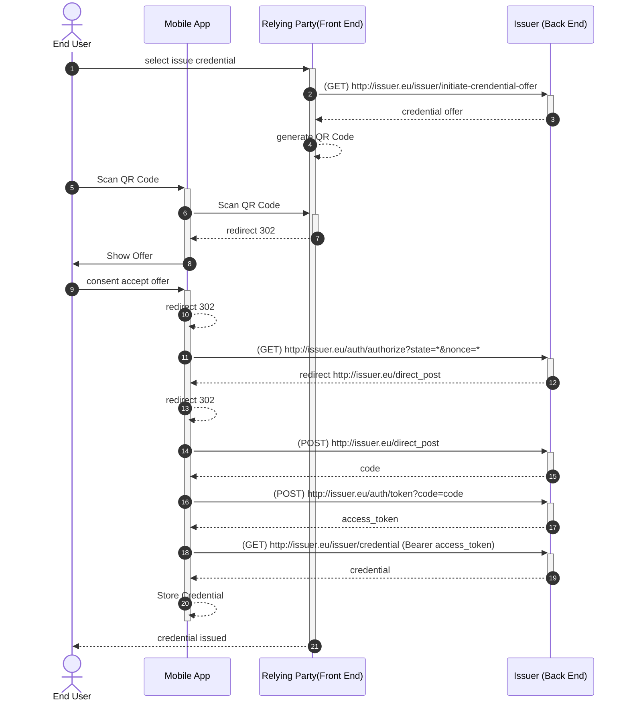
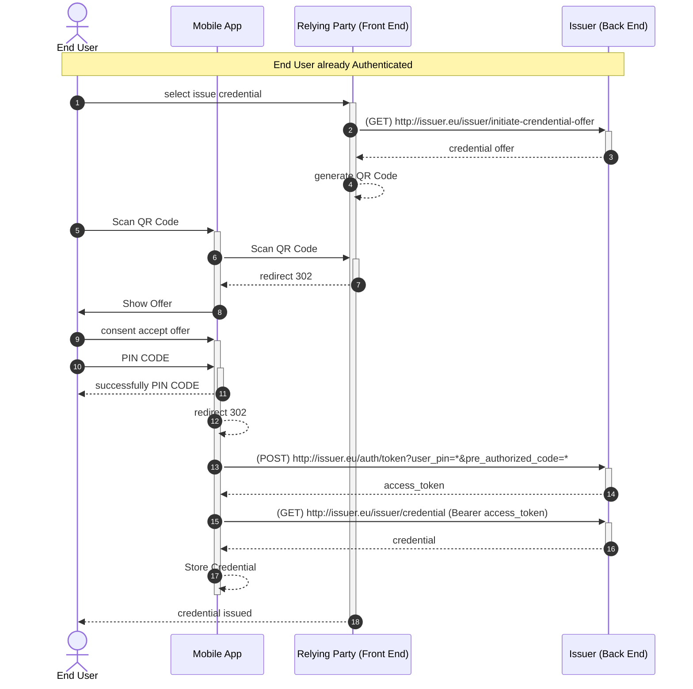

# RFC001: Issue Verifiable Credentials - v1.0

**Authors:**

* Angel Palomares (<angel.palomares@eviden.com>)

**Reviewers:**

* Alberto Crespo (<alberto.crespo@eviden.com>)
* Lluis Ariño (<lluisalfons.arino@urv.cat>)

**Status:** Approved for v1.0 release???

**Table of Contents:**

* [1 Summary](#1-summary)
* [2 Issue Credential Authorize Flow](#2-issue-credential-authorize-flow)
  * [2.1 No Authorized Issue Credential](#21-no-authorized-issue-credential)
  * [2.2 Pre Authorized Issue Credential](#22-pre-authorized-issue-credential)
* [3 Message Details](#3-message-details)
  * [3.1 Initiate Credential Offer](#31-initiate-credential-offer)
  * [3.2 Credential Offer Response](#32-credential-offer-response)
  * [3.3 Authorization request](#33-authentication-request-authorize)
  * [3.4 Authorization response](#34-authentication-response-direct_post)
  * [3.5 Token request](#35-token-request)
  * [3.6 Token Response](#36-token-response)
  * [3.7 Credential Request](#37-credential-request)
  * [3.8 Credential Response](#38-credential-response)
* [4 Error Response Format](#4-error-response-format)
* [5 References](#5-references)

## [1 Summary](#1-summary)

This specification details the implementation of the [OpenID for Verifiable Credential Issuance (VCI) Draft 11](https://openid.net/specs/openid-4-verifiable-credential-issuance-1_0-11.html) workflow for any issuer  in accordance with the reference specification of the European Wallet Ecosystem defined in the [Architecture and Reference Framework (ARF)](https://eu-digital-identity-wallet.github.io/eudi-doc-architecture-and-reference-framework/1.1.0/arf/).

## [2 Issue Credential Authorize Flow](#2-issue-credential-authorize-flow)

The following diagrams show the different use cases taken into consideration:

* No Authorized Issue Credential: the end user hasn't already identify, thereby the flow includes an authentication mechanism
* Pre Authorized Issue Credential: the end user obtains a verifiable credential after he/she has already been identified in the system

### [2.1 No Authorized Issue Credential](#21-no-authorized-issue-credential)

The **Issuer** implementation for No Authorized Issue Credential is based on the [OpenID Connect for Verifiable Credentials Issue](https://openid.net/specs/openid-4-verifiable-credential-issuance-1_0.html).
As the end user hasn't been authenticated and authorized, the process of Issue Credential is based on the use of a QR Code to redirect the end user to the **Issuer**.
From that moment on, the end user can, using the **Mobile App**, scan the QR Code and accept the offer of the credential.
The following diagram shows the sequence of the No Authorized Issue Credential process.

Figure 1 shows when the Relying Party only has a Front End:



      Figure 1: Issue Credential with Authorization
      
Figure 1 diagram describes the steps involved in issuing a verifiable credential to an end user who has not been authenticated previously. Here is a step-by-step description of the process:

1. **End User selects to issue a credential:** The end user  initiates the process by selecting the option to issue a credential on the 2 Relying Party's front end .
2. **Relying Party requests credential offer:** The front end  sends a GET request to the Issuer's back end  at the endpoint <http://issuer.eu/issuer/initiate-crendential-offer> to initiate the credential offer.
3. **Issuer responds with credential offer:** The Issuer's back end  responds to the front end  with the credential offer.
4. **Front End generates QR Code:** The front end  generates a QR Code based on the credential offer.
5. **End User scans QR Code:** The end user  uses their Mobile App (mobile) to scan the QR Code.
6. **Mobile App scans QR Code:** The Mobile App (mobile) sends a request to the front end  with the scanned QR Code data.
7. **Front End redirects Mobile App:** The front end  responds to the Mobile App (mobile) with a 302 redirect.
8. **Mobile App shows offer to End User:** The Mobile App (mobile) displays the credential offer to the end user .
9. **End User consents to accept offer:** The end user  consents to accept the credential offer on the Mobile App (mobile).
10. **Mobile App redirects:** The Mobile App (mobile) performs a 302 redirect.
11. **Mobile App requests authorization:** The Mobile App (mobile) sends a GET request to the Issuer's back end  at the endpoint <http://issuer.eu/auth/authorize> with the state and nonce parameters.
12. **Issuer redirects Mobile App:** The Issuer's back end  responds to the Mobile App (mobile) with a redirect to <http://issuer.eu/direct_post>.
13. **Mobile App redirects:** The Mobile App (mobile) performs a 302 redirect.
14. **Mobile App requests token:** The Mobile App (mobile) sends a POST request to the Issuer's back end  at the endpoint <http://issuer.eu/direct_post> to obtain a code.
15. **Issuer responds with code:** The Issuer's back end  responds to the Mobile App (mobile) with a code.
16. **Mobile App requests access token:** The Mobile App (mobile) sends a POST request to the Issuer's back end  at the endpoint <http://issuer.eu/auth/token> with the obtained code to get an access token.
17. **Issuer responds with access token:** The Issuer's back end  responds to the Mobile App (mobile) with an access token.
18. **Mobile App requests credential:** The Mobile App (mobile) sends a GET request to the Issuer's back end  at the endpoint <http://issuer.eu/issuer/credential> with the access token to request the credential.
Issuer responds with credential:
19. **Issuer responds with credential:** The Issuer's back end  responds to the Mobile App (mobile) with the credential.
20. **Mobile App stores credential:** The Mobile App (mobile) stores the received credential.
21. **Front End notifies End User:** The front end  notifies the end user  that the credential has been issued.

This sequence ensures that the end user securely receives and stores the verifiable credential after being authenticated and providing consent.

### [2.2 Pre Authorized Issue Credential](#22-pre-authorized-issue-credential)

Where in this particular case, the authentication and authorization is done previously, therefor it is not necessary to perform it again.
Thereby to assure the security of the process, the **Issuer** implementation for PreAuthorized Issue Credential is based on the use of a PIN Code provided to the end user.
The following diagram shows the sequence of the PreAuthorized Issue Credential process.



          Figure 2: Issuing a credential with a Pre Authorization

Figure 2  describes the steps involved in issuing a verifiable credential to an end user who has not been authenticated previously. Here is a step-by-step description of the process:

1. **End User selects to issue a credential:** The end user initiates the process by selecting the option to issue a credential on the Relying Party's front end .
2. **Relying Party requests credential offer:** The front end  sends a GET request to the Issuer's back end  at the endpoint <http://issuer.eu/issuer/initiate-crendential-offer> to initiate the credential offer.
3. **Issuer responds with credential offer:** The Issuer's back end  responds to the front end  with the credential offer.
4. **Front End generates QR Code:** The front end  generates a QR Code based on the credential offer.
5. **End User scans QR Code:** The end user  uses their Mobile App (mobile) to scan the QR Code.
6. **Mobile App scans QR Code:** The Mobile App (mobile) sends a request to the front end  with the scanned QR Code data.
7. **Front End redirects Mobile App:** The front end  responds to the Mobile App (mobile) with a 302 redirect.
8. **Mobile App shows offer to End User:** The Mobile App (mobile) displays the credential offer to the end user .
9. **End User consents to accept offer:** The end user  consents to accept the credential offer on the Mobile App (mobile).
10. **Mobile App redirects:** The Mobile App (mobile) performs a 302 redirect.
11. **Mobile App requests authorization:** The Mobile App (mobile) sends a GET request to the Issuer's back end  at the endpoint <http://issuer.eu/auth/authorize> with the state and nonce parameters.
12. **Issuer redirects Mobile App:** The Issuer's back end  responds to the Mobile App (mobile) with a redirect to <http://issuer.eu/direct_post>.
13. **Mobile App redirects:** The Mobile App (mobile) performs a 302 redirect.
14. **Mobile App requests token:** The Mobile App (mobile) sends a POST request to the Issuer's back end  at the endpoint <http://issuer.eu/direct_post> to obtain a code.
15. **Issuer responds with code:** The Issuer's back end  responds to the Mobile App (mobile) with a code.
16. **Mobile App requests access token:** The Mobile App (mobile) sends a POST request to the Issuer's back end  at the endpoint <http://issuer.eu/auth/token> with the obtained code to get an access token.
17. **Issuer responds with access token:** The Issuer's back end  responds to the Mobile App (mobile) with an access token.
18. **Mobile App requests credential:** The Mobile App (mobile) sends a GET request to the Issuer's back end  at the endpoint <http://issuer.eu/issuer/credential> with the access token to request the credential.
19. **Issuer responds with credential:** The Issuer's back end  responds to the Mobile App (mobile) with the credential.
20. **Mobile App stores credential:** The Mobile App (mobile) stores the received credential.
21. **Front End notifies End User:** The front end  notifies the end user  that the credential has been issued.

## [3 Message Details](#3-message-details)

### [3.1 Initiate Credential Offer](#31-initiate-credential-offer)

Although the standard doesn't specify how to trigger the credential offer, we define the initialize of the credential offer following the suggestions proposed by EBSI.

```http
GET from https://issuer.eu/issuer/initiate-credential-offer?
  credential_type=VerifiableCredentialDiploma
  &bearer_token=Bearer eyJhbGc..
  &nonce=d527c191-6e1d-4c3d-9843-9eaf2005fba9
```

Where the description of the fields is as follows:

| Field                         | Description                                                                                                                                                                                                                                         |
|-------------------------------|-----------------------------------------------------------------------------------------------------------------------------------------------------------------------------------------------------------------------------------------------------|
| **credential_offer_endpoint** | REQUIRED. To define the the output, by default: credential_offer_endpoint=openid-credential-offer://                                                                                                                                                |
| **credential_type**           | REQUIRED. String containing the Verifiable Credential Identifier.                                                                                                                                                                                   |
| **bearer_token**              | OPTIONAL. For the Pre authorize cases, it is assumed the authentication process performed before hand has as a result an access token, containing information of the end user. This information will be used to help obtaining the user information |
| **nonce**                     | OPTIONAL. A value used to link a client session to prevent replay attacks. This initial nonce will also help to the Relying Party to track the status of the flow                                                                                   |

### [3.2 Credential Offer Response](#32-credential-offer-response)

In order to avoid overloading the result of the QRCode, the standard defines a entry point based on `credential_offer_uri`parameter:

```http
openid-credential-offer://?credential_offer_uri=https://issuer.eu/issuer/offers/719307744250317677
```

The response to resolving the  `credential_offer_uri` will be different depending if is an No Authorize flow or a Pre Authorize flow.
For the No Authorize flow the response will be as follows:
```json
{
   "credential_issuer":"https://issuer.eu/issuer",
   "credentials":[
      {
         "format":"jwt_vc",
         "types":[
            "VerifiableCredential",
            "VerifiableCredentialDiploma"
         ],
         "display":[
            {
               "name":"VerifiableCredentialDiploma",
               "description":"Description of the Verifiable Credential"
            }
         ],
         "credentialSubject":{
            "id":{
               "display":[
                  {
                     "name":"id"
                  }
               ]
            },
            ...
           
         }
      }
   ],
   "grants":{
      "authorization_code":{
         "issuer_state":"eyJraWQiO..."
      }
   }
}
```

When for a Pre Authorized flow the response will be as follows:

```json
{
   "credential_issuer":"https://tadpole-internal-mammal.ngrok-free.app/issuer",
   "credentials":[
      {
         "format":"jwt_vc",
         "types":[
            "VerifiableCredential",
            "VerifiableCredentialDiploma"
         ],
         "display":[
            {
               "name":"VerifiableCredentialDiploma",
               "description":"Description of the Verifiable Credential"
            }
         ],
         "credentialSubject":{
            "id":{
               "display":[
                  {
                     "name":"id"
                  }
               ]
            },
            ...
           
         }
      }
   ],
   "grants":{
      "urn:ietf:params:oauth:grant-type:pre-authorized_code":{
         "pre-authorized_code":"eyJraWQiOiJkaWQ...",
         "user_pin_required":true
      }
   }
}
```

Where the `issuer_state` or `pre_authorized_code` parameters, depending on the flow, will be required later on during the issue process.

### [3.3 Authentication Request `/authorize`](#33-authentication-request-authorize)

#### 3.3.1 Request

Once the credential offer is read by the end user, the mobile app will execute the authorization request. This step only will happen in the case that the end user hasn't been authorized before hand. An example of the request is as follows:

```http
GET from https://issuer.eu/authorize?
  client_id=did:key:z2dmzD81cg...
  &response_type=code
  &scope=openid
  &response_uri=https://client.example.com
  &response_mode=direct_post
  &state=8d8b6a3d-4bc0-4234-9a9a-ed1928815502
  &nonce=d527c191-6e1d-4c3d-9843-9eaf2005fba9
  &issuer_state=eyJra...
  &code_challenge=wQ7kWVb4OwAxCtsMYALu9JXJjEujyZYUaD8k4tD0bMc
  &authorization_details=[{"type":"openid_credential","format":"jwt_vc_json","types":["VerifiableCredential","VerifiableCredentialDiploma"]}]
  &client_metadata={"authorization_endpoint":"https://client.example.com","response_types_supported":["vp_token","id_token"],"vp_formats_supported":{"jwt_vp":{"alg_values_supported":["ES256"]},"jwt_vc":{"alg_values_supported":["ES256"]}}}
```

The authorization request will contain the following parameters:

<table>
  <tr>
   <td><code>client_id</code></td>
   <td>REQUIRED. Verifier identifier that cab be a  URI or a DID. This value must be present in <code>sub</code> field of the verifiable presentation JWT
   </td>
  </tr>
  <tr>
   <td><code>response_type</code></td>
   <td>REQUIRED. The value must be <code>code</code>
   </td>
  </tr>
  <tr>
   <td><code>scope</code></td>
   <td>REQUIRED. OpenID Connect requests MUST contain the openid scope value. If the openid scope value is not present, the behavior is entirely unspecified.
   </td>
  </tr>
  <tr>
   <td><code>redirect_uri</code></td>
   <td> Optional. URL for redirecting back to the client. If not defined will be returned openid://
   </td>
  </tr>
  <tr>
   <td><code>state</code></td>
   <td>OPTIONAL. The client uses an opaque value to maintain the state between the request and callback. This value will be used for obtaining the events associated to this specific verification flow.
   </td>
  </tr>
  <tr>
   <td><code>nonce</code></td>
   <td>OPTIONAL. Securely bin verifiable presentations provided by the wallet to a particular transaction
   </td>
  </tr>
  <tr>
   <td><code>issuer_state</code></td>
   <td>REQUIRED. If Credential Offering contained issuer_state.</td>
  </tr>
  <tr>
   <td><code>code_challenge</code></td>
   <td>OPTIONAL. Only for Holder Wallets. In format of BASE64URL-ENCODE(SHA256(code_verifier as UTF-8 string)). code_verifier is client generated secure random, which will be used with token endpoint. It is between 43 and 128 characters long, and contains characters A-Z, a-z, 0-9, hyphen, period, underscore, and tilde.</td>
  </tr>
  <tr>
   <td><code>authorization_details</code></td>
   <td>OPTIONAL. Only for Holder Wallets. OID authorisation details data model. Note: authorization_details must be a stringified JSON array. See "OID4VCI Authorisation Details" schema for more information.</td>
  </tr>
  <tr>
   <td><code>client_metadata</code></td>
   <td>OPTIONAL. Only for Holder Wallets. Client Metadata including a link to an authorization_endpoint (optional). Note: client_metadata must a stringified JSON object. See "Client Metadata" schema for more information.</td>
  </tr>
</table>

#### 3.3.2 Response

The standard recommends to response with a `request_uri` which means the authorization request is presented by reference. The Request URI has to be resolved to obtain the JWT, which contains the above fields in the claims. An example is as given below:

```http
HTTP 302 Location: openid://?request_uri=https://issuer.eu/request_uri/a044aea-275d-43d6-8ec4-0ae88df46256
```

The reference as defined in JWT-Secured Authorization Request (JAR) via use of `request_uri` [3]. The custom URL scheme for authorization requests is `openid://`. An  example of the JAR object responded by the verifier is as given below:

```http
HTTP Response Payload: Content-Type plain/text

eyJraWQi...

```


### [3.4 Authentication Response `/direct_post`](#34-authentication-response-direct_post)

#### 3.4.1 Request

The end user, using the mobile app then responds with an `vp_token` signed by the DID to the direct post endpoint.

```http
POST https://verifier.com/direct_post
Content-Type: application/x-www-form-urlencoded

&vp_token=eyJraWQiOiJk...Z-1_msCBcxh7XEA
&presentation_submission={"definition_id":"9a044aea-275d-43d6-8ec4-0ae88df46256",...}
&state=475e634e-2633-4235-953d-eb879334cae7
```

Authorization response is sent to the previously obtained /direct_post URl including the `vp_token` and `presentation_submission` values.

On one hand the `vp_token` can be as follows:

``` jwt
eyJraWQiOiJka...
```

Where the content of the decoded jwt will be as follows:

```json
{
  "nonce": "glkFFoisdfEui4312",
  "state": "92b6e05c-5c3b-4194-bba8-1da1b2a5dd62",
  "vp": {
    "@context": [
      "https://www.w3.org/2018/credentials/v1"
    ],
    "id": "urn:uuid:297b29a9-4872-49cd-a673-e7e2b239a9a7",
    "type": [
      "VerifiablePresentation"
    ],
    "holder": "did:key:z2dmzD81cgPx8Vki...",
    "verifiableCredential": [
      "eyJraWQiOiJka..."
    ]
  },
  "iat": 1738577190,
  "iss": "https://issuer.eu/auth",
  "sub": "https://issuer.eu/auth",
  "aud": "https://issuer.eu/auth",
  "nbf": 1738577190,
  "exp": 1738578090
}
```
On the other hand an example of `presentation_submission` is as follows:

```json
{
  "id": "a044aea-275d-43d6-8ec4-0ae88df46256",
  "definition_id": "841fd89b-f987-4052-88fc-30affccfd99c",
  "descriptor_map": [
    {
      "id": "2cfa0952-76ae-4172-a1c1-d223a8c00ce8",
      "format": "jwt_vp",
      "path": "$",
      "path_nested": {
        "id": "2cfa0952-76ae-4172-a1c1-d223a8c00ce8",
        "format": "jwt_vc",
        "path": "$.verifiableCredential[0]"
      }
    }
  ]
}
```

#### 3.4.2 Response

The response obtained will be a redirection (HTTP Status 302) to the mobile wallet which needs to follow the redirection to the callback URL previously defined in the `redirect_uri`.
An example of the response obtained is as follows:

```http
HTTP 302 Location: https://issuer.eu?code=d527c191-6e1d-4c3d-9843-9eaf2005fba9&state=8d8b6a3d-4bc0-4234-9a9a-ed1928815502
```

### [3.5 Token request](#35-token-request)

The following section describes the process for obtaining an access token, that can be used later on for authorize to the end user to perform subsequence operations

#### 3.6.1 Request

For obtaining the access token will directly depends on the flow applied in each case.

##### 3.6.1.1 No Authorize Flow Request

```http
POST https://issuer.eu/token
Content-Type: application/x-www-form-urlencoded

grant_type=authorization_code,
&client_id=did:key:z2dmzD81c...,
&code=d527c191-6e1d-4c3d-9843-9eaf2005fba9,
&code_verifier=random-secret
}
```

This request is made with the following query params:

<table>
  <tr>
   <td><code>grant_type</code></td>
   <td>Grant type for authorisation. E.g. <code>authorization_code</code></td>
  </tr>
  <tr>
   <td><code>client_id</code></td>
   <td>Decentralised identifier</td>
  </tr>
  <tr>
   <td><code>code</code></td>
   <td>Authorisation code obtaining in the previous step</td>
  </tr>
  <tr>
   <td><code>code_verifier</code></td>
   <td> Secure random token used to validate the original <code>code_challenge</code> provided in the initial Authorization Request</td>
  </tr>
   <tr>
   <td><code>redirect_uri</code></td>
   <td>For redirection of the response. Further information can be found in <a href=#https://www.rfc-editor.org/rfc/rfc6749.html#section-3.1.2">IETF RFC6749 Section 3.1.2</a></td>
  </tr>
</table>

##### 3.6.1.1 Pre Authorize Flow Request

```http
POST https://issuer.eu/token
Content-Type: application/x-www-form-urlencoded

grant_type=urn:ietf:params:oauth:grant-type:pre-authorized_code
&redirect_uri=https://client.example.com
&pre_authorized_code=eyJraWQ...
&user_pin=1234
}
```

Where the detail of the request parameters is as follows:

<table>
  <tr>
   <td><code>grant_type</code></td>
   <td>Grant type for authorisation. E.g. <code>urn:ietf:params:oauth:grant-type:pre-authorized_code</code></td>
  </tr>
  <tr>
   <td><code>redirect_uri</code></td>
   <td>For redirection of the response. Further information can be found in <a href=#https://www.rfc-editor.org/rfc/rfc6749.html#section-3.1.2">IETF RFC6749 Section 3.1.2</a></td>
  </tr>
  <tr>
   <td><code>pre-authorized_code</code></td>
   <td>Code obtained from the credential offer response. This code must be short-lived and single-use.</td>
  </tr>
  <tr>
   <td><code>user_pin</code></td>
   <td>PIN code obtained from the issuer for the security verification (OPTIONAL)</td>
  </tr>
</table>

### [3.6 Token Response](#36-token-response)
  
The response from the issuer will have the following aspect:

```http
HTTP Response Payload: Content-Type application/json
{
   "access_token":"eyJraWQiOiJkaWQ6a2V5OnoyZG16RDgxY2dQeDhWa2k3SmJ1dU1tRllyV1BnWW95dHlrVVozZXlxaHQxajlLYnBpcjZjekJ6blJnNW1VM3VmUENtSlBCeFFGQ0VMZ2p0aHlRb0FzRFBUMWZoZG03Vzg2akNRQ3VjRGNkR2R2Mm0zdTdGdFBpb2FSajROUGhKSzl5bUdqczRyOEdiUDNwV0FZc2lZYmloNEZXQWdScmRFZDFxeXJnY1pBSDFiN3N6WTQjejJkbXpEODFjZ1B4OFZraTdKYnV1TW1GWXJXUGdZb3l0eWtVWjNleXFodDFqOUticGlyNmN6QnpuUmc1bVUzdWZQQ21KUEJ4UUZDRUxnanRoeVFvQXNEUFQxZmhkbTdXODZqQ1FDdWNEY2RHZHYybTN1N0Z0UGlvYVJqNE5QaEpLOXltR2pzNHI4R2JQM3BXQVlzaVliaWg0RldBZ1JyZEVkMXF5cmdjWkFIMWI3c3pZNCIsInR5cCI6IkpXVCIsImFsZyI6IkVTMjU2In0.eyJhdWQiOiJodHRwczovL3RhZHBvbGUtaW50ZXJuYWwtbWFtbWFsLm5ncm9rLWZyZWUuYXBwL2lzc3VlciIsInN1YiI6ImRpZDprZXk6ejJkbXpEODFjZ1B4OFZraTdKYnV1TW1GWXJXUGdZb3l0eWtVWjNleXFodDFqOUticGlyNmN6QnpuUmc1bVUzdWZQQ21KUEJ4UUZDRUxnanRoeVFvQXNEUFQxZmhkbTdXODZqQ1FDdWNEY2RHZHYybTN1N0Z0UGlvYVJqNE5QaEpLOXltR2pzNHI4R2JQM3BXQVlzaVliaWg0RldBZ1JyZEVkMXF5cmdjWkFIMWI3c3pZNCIsImlzcyI6Imh0dHBzOi8vdGFkcG9sZS1pbnRlcm5hbC1tYW1tYWwubmdyb2stZnJlZS5hcHAvYXV0aCIsImNsYWltcyI6eyJhdXRob3JpemF0aW9uRGV0YWlscyI6bnVsbCwiY05vbmNlIjoiZDUyN2MxOTEtNmUxZC00YzNkLTk4NDMtOWVhZjIwMDVmYmE5IiwiY05vbmNlRXhwaXJlc0luIjoxNzExNTMyMTEyODUxLCJjbGllbnRJZCI6ImRpZDprZXk6ejJkbXpEODFjZ1B4OFZraTdKYnV1TW1GWXJXUGdZb3l0eWtVWjNleXFodDFqOUticGlyNmN6QnpuUmc1bVUzdWZQQ21KUEJ4UUZDRUxnanRoeVFvQXNEUFQxZmhkbTdXODZqQ1FDdWNEY2RHZHYybTN1N0Z0UGlvYVJqNE5QaEpLOXltR2pzNHI4R2JQM3BXQVlzaVliaWg0RldBZ1JyZEVkMXF5cmdjWkFIMWI3c3pZNCJ9LCJleHAiOjE3MTE1MzIxMTIsImlhdCI6MTcxMTUzMTgxMiwibm9uY2UiOiJkNTI3YzE5MS02ZTFkLTRjM2QtOTg0My05ZWFmMjAwNWZiYTkifQ.PfRIvQZ60BszV3HcynM-7BJHOKm0v5K9PGcoOrTw8dIZXqVdjZmuZVaQVEJ_DrQD_gLbfjOyJbxh6xfe6efWVw",
   "id_token":"eyJraWQiOiJkaWQ6a2V5OnoyZG16RDgxY2dQeDhWa2k3SmJ1dU1tRllyV1BnWW95dHlrVVozZXlxaHQxajlLYnBpcjZjekJ6blJnNW1VM3VmUENtSlBCeFFGQ0VMZ2p0aHlRb0FzRFBUMWZoZG03Vzg2akNRQ3VjRGNkR2R2Mm0zdTdGdFBpb2FSajROUGhKSzl5bUdqczRyOEdiUDNwV0FZc2lZYmloNEZXQWdScmRFZDFxeXJnY1pBSDFiN3N6WTQjejJkbXpEODFjZ1B4OFZraTdKYnV1TW1GWXJXUGdZb3l0eWtVWjNleXFodDFqOUticGlyNmN6QnpuUmc1bVUzdWZQQ21KUEJ4UUZDRUxnanRoeVFvQXNEUFQxZmhkbTdXODZqQ1FDdWNEY2RHZHYybTN1N0Z0UGlvYVJqNE5QaEpLOXltR2pzNHI4R2JQM3BXQVlzaVliaWg0RldBZ1JyZEVkMXF5cmdjWkFIMWI3c3pZNCIsInR5cCI6IkpXVCIsImFsZyI6IkVTMjU2In0.eyJzdWIiOiJkaWQ6a2V5OnoyZG16RDgxY2dQeDhWa2k3SmJ1dU1tRllyV1BnWW95dHlrVVozZXlxaHQxajlLYnBpcjZjekJ6blJnNW1VM3VmUENtSlBCeFFGQ0VMZ2p0aHlRb0FzRFBUMWZoZG03Vzg2akNRQ3VjRGNkR2R2Mm0zdTdGdFBpb2FSajROUGhKSzl5bUdqczRyOEdiUDNwV0FZc2lZYmloNEZXQWdScmRFZDFxeXJnY1pBSDFiN3N6WTQiLCJhdWQiOiJkaWQ6a2V5OnoyZG16RDgxY2dQeDhWa2k3SmJ1dU1tRllyV1BnWW95dHlrVVozZXlxaHQxajlLYnBpcjZjekJ6blJnNW1VM3VmUENtSlBCeFFGQ0VMZ2p0aHlRb0FzRFBUMWZoZG03Vzg2akNRQ3VjRGNkR2R2Mm0zdTdGdFBpb2FSajROUGhKSzl5bUdqczRyOEdiUDNwV0FZc2lZYmloNEZXQWdScmRFZDFxeXJnY1pBSDFiN3N6WTQiLCJpc3MiOiJodHRwczovL3RhZHBvbGUtaW50ZXJuYWwtbWFtbWFsLm5ncm9rLWZyZWUuYXBwL2F1dGgiLCJleHAiOjE3MTE1MzIxMTIsImlhdCI6MTcxMTUzMTgxMiwibm9uY2UiOiJkNTI3YzE5MS02ZTFkLTRjM2QtOTg0My05ZWFmMjAwNWZiYTkifQ.J4pf5vIUxJY34m4v7iX6HeKwzIZi_6eJTiUtseeOB5aHcm-P1B9-7Hb0vjrHuCLt2Eb3JUrHirGtCf0AD29ynQ",
   "token_type":"Bearer",
   "expires_in":1711532112851,
   "c_nonce":"d527c191-6e1d-4c3d-9843-9eaf2005fba9",
   "c_nonce_expires_in":1711532112851
}
```

### [3.7 Credential Request](#37-credential-request)

Once the access token has been obtained in the previous step, the end user can now request to obtain the issued verifiable credential. An example of this request is as follows:

```http
POST /credential
Content-Type: application/json
Authorization: Bearer eyJ0eXAi...

{
   "format":"jwt_vc",
   "types":[
      "VerifiableCredential",
      "VerifiableCredentialDiploma"
   ],
   "proof":{
      "proof_type":"jwt",
      "jwt":"eyJ0eXAiOi..."
   }
}
```

Where the details of the parameters is as follows:
<table>
  <tr>
   <td><code>Authorization: Bearer eyJ0eXAi...</code></td>
   <td>Access token obtained in the previous step</td>
  </tr>
  <tr>
   <td><code>format</code></td>
   <td>Defining the output format of the credential</td>
  </tr>
  <tr>
   <td><code>types</code></td>
   <td>Defining the specific credential to be issued</td>
  </tr>
  <tr>
   <td><code>proof</code></td>
   <td>Object with contains a signed client_assertion JWT with client's private keys, which public key counterparts are resolvable through jwks_uri or is in the Client Metadata shared in the pre-registration step.</td>
  </tr>
</table>


### [3.8 Credential Response](#38-credential-response)

Finally, the issuer response with the verifiable credential requested. An example of the response of the server is as follows:

```json
{
   "format":"jwt_vc",
   "credential":"eyJraWQ..."
}
```

## [4 Error Response Format](#4-error-response-format)

Standard HTTP response codes shall be supported.

```json
{
  "error": "invalid_request",
  "error_description": "Verification failed"
}
```

Where the description of these parameters is the following:

<table>
  <tr>
   <td><code>error</code></td>
   <td>Error identifier</td>
  </tr>
  <tr>
   <td><code>error_description</code></td>
   <td>Description of the error</td>
  </tr>
</table>

## [5 References](#5-references)

1. [OpenID for Verifiable Credential Issuance (VCI) Draft 11](https://openid.net/specs/openid-4-verifiable-credential-issuance-1_0-11.html)
2. [The European Digital Identity Wallet Architecture and Reference Framework (v1.4.0)](https://github.com/eu-digital-identity-wallet/eudi-doc-architecture-and-reference-framework/releases/tag/v1.4.0)
3. [RFC 9101 OAuth 2.0 Authorization Framework: JWT-Secured Authorization Request (JAR)](https://www.rfc-editor.org/rfc/rfc9101.html#name-request-using-the-request_u)
4. [DIF Presentation Exchange](https://identity.foundation/presentation-exchange)
