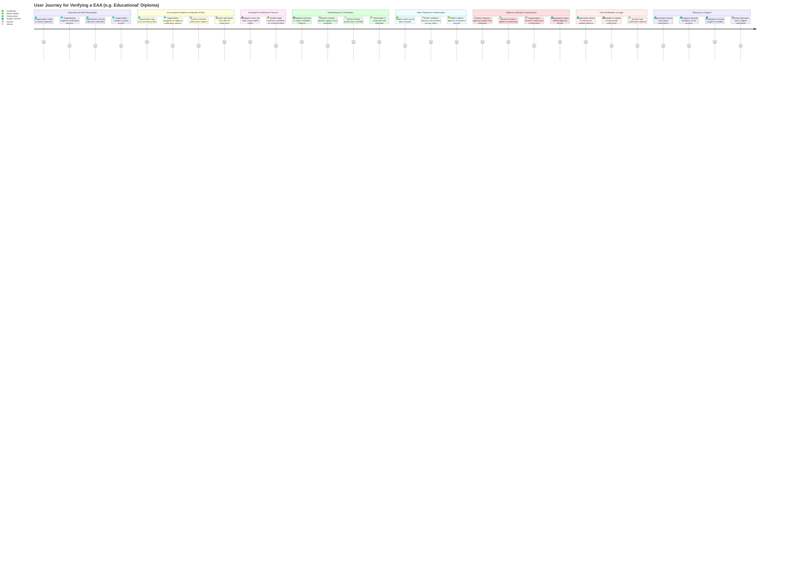

## **User Journey for Verifying a EAA (e.g. Academic/Professional Achievement)**

### **1. Awareness & Need Recognition**
- Organization or employer needs to verify a candidate’s Academic/Professional Achievement.  
- They explore the process of **Academic/Professional EAA verification**.  
- They check the required documents and digital credentials.  
- They confirm their access to the verification system.  

### **2. Accessing the EAA Verification Portal**
- Organization logs into the **edcuational/professioal’s verification portal**.  
- They navigate to the **EAA verification section**.  
- They initiate a **verification request**.  
- The system generates a **QR code** for secure verification.  

### **3. Initiating the Verification Process**
- Candidate accesses the portal or receives a verification request.  
- They scan the **QR code** using their **EUDI mobile wallet**.  
- The EUDI mobile wallet **redirects them** for authentication.  

### **4. Authentication & Verification**
- Candidate **grants consent** to share their **EAA containing Academic/Professional Achievement**.  
- The system verifies the **EAA’s authenticity** using the Trust Models (classical PKI + DPKY using EBSI infrastructure).  
- The verifier checks the **EAA against the EBSI DID Registry & Trust Registries** for eductaional/professional qualifications' governance.  
- The verification process is **confirmed and validated**.  

### **5. Token Request & Authorization**
- The EUDI mobile wallet sends a **token request** to the verifier.  
- The verifier validates the request and provides an **access token**.  
- The candidate’s **EUDI wallet submits the EAA verification request** using the token.  

### **6. EAA Verification Confirmation**
- The verifier **retrieves EAA details** related to EAA status, authorisation related governnace uding the **underlaying dPKI infrastructure' services**.  
- The system **confirms the diploma’s authenticity**.  
- A **notification is sent** to the organization about the verification result.  
- The organization sees the **verified diploma details**.  

### **7. Post-Verification & Usage**
- The organization can **store or reference** the verified Academic/Professional Achievement.  
- Candidate is notified that their Academic/Professional Achievement was successfully verified.  
- The system keeps a **log/audit of the verification request and result**.  

### **8. Advocacy & Support**
- Organizations share their **experience** with EAA verification.  
- Employers provide **feedback** about the verification process.  
- Candidates can request **support in case of any issues**.  
- The system **promotes trust in digital credentials**.  

---

## **Mermaid User Journey Diagram**

